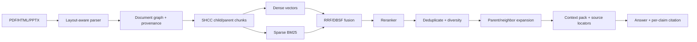

# Indexing và retrieval design v0.1

Ngày cập nhật: 2026-09-04

Trạng thái: proposed; lựa chọn cuối phải dựa trên evaluation.

Clarification 2026-09-06: vendor/options ở đây là research history. Identity, authorization, generation projection và activation hiện hành theo [content/index boundary v0.1.1](../../contracts/content-unit-index.md), không copy payload-role filters cũ thành authorization authority. Candidate dedup không được collapse conflicting versions.

[Evidence pipeline contract](05-evidence-pipeline-contract.md) bổ sung lineage và versioning trước implementation. Index chưa được xây; Qdrant/model names bên dưới vẫn là phương án nghiên cứu, không phải stack đã chọn. Page fields trong payload áp dụng cho PDF, HTML dùng locator theo representation; permission payload không thay authority/currentness checks của Backend.

Phạm vi dưới đây là **text-path baseline**. Với PDF có đồ thị/sơ đồ/handout, đọc thêm [dual-path visual retrieval](03-visual-pdf-retrieval.md). `late` trong thiết kế text không tự động tương đương visual embedding. Các nhánh phải có representation/profile riêng, normalize về candidate group trước fusion và kế thừa ACL cả khi fetch ảnh/parent.

## 1. Kiến trúc đề xuất



## 2. Qdrant point design

Mỗi point đại diện một child chunk. Parent text được lưu ở document store hoặc point riêng có `record_type=parent`; không trộn parent và child trong cùng candidate list nếu chưa có rule rõ ràng.

### Named vectors

- `dense`: embedding của `retrieval_text`.
- `sparse`: BM25/sparse representation của cùng `retrieval_text`.
- `late`: optional multi-vector cho ColBERT-style reranking; không bật ở baseline.

Qdrant hỗ trợ dense+sparse prefetch và fusion bằng RRF hoặc DBSF. Tài liệu của Qdrant khuyến nghị RRF làm safe default khi chưa có score priors/eval; không cộng thẳng raw cosine và BM25 score vì khác thang đo. Xem [Hybrid Queries](https://qdrant.tech/documentation/search/hybrid-queries/).

### Payload bắt buộc

- `chunk_id`, `parent_id`, `document_id`, `document_version`, `corpus_snapshot`.
- `course_id`, `term`, `department`, `language`, `document_type`.
- `section_path`, `heading`, `element_types`.
- `page_start`, `page_end`, `source_locators`, `element_ids`.
- `prev_chunk_id`, `next_chunk_id`.
- `content_hash`, `parser_profile`, `chunker_profile`, `embedding_profile`.
- `rights_status`, `lifecycle_status`, `allowed_roles`, `allowed_courses`, `allowed_terms`, `sensitivity`.
- `quality_flags`: OCR, reading order, table/formula/asset state.

Payload index được tạo trước ingest cho các trường dùng làm filter. Qdrant ghi rõ filtering nên dùng payload index; strict mode có thể chặn filter trên field chưa index. Xem [Qdrant filtering](https://qdrant.tech/documentation/search/filtering/) và [text filtering](https://qdrant.tech/documentation/search/text-search/text-filtering/).

## 3. Permission filter trước similarity search

Authorization context được backend xác định từ session, không lấy từ câu chữ người dùng.

Filter tối thiểu:

```text
resource_owner_partition belongs to exact PDP-issued resource bindings
AND resource/version is eligible for requested action and purpose
AND current tenant relation OR exact current public/share binding is allowed by PDP
AND applicable rights/lifecycle/sensitivity/term constraints pass
AND no explicit deny
```

Không retrieve rộng rồi mới xóa tài liệu unauthorized sau reranking. Qdrant hỗ trợ partition/filter theo payload và tenant field cho isolation; xem [Qdrant multitenancy](https://qdrant.tech/documentation/manage-data/multitenancy/).

## 4. Query-time pipeline

### Step 1 — Query understanding

- Chuẩn hóa Unicode nhưng giữ query gốc.
- Nhận diện course, term, document type, title/ID và yêu cầu thời sự.
- Router chọn Academic, Learning, Hub hoặc clarify.
- Không để LLM tự tạo access filter vượt quyền backend.

### Step 2 — Candidate generation

- Dense search tìm tương đồng ngữ nghĩa.
- Sparse BM25 bắt thuật ngữ, mã, tên chương, ký hiệu và lỗi chính tả gần nguyên văn.
- Prefetch độc lập rồi fusion bằng RRF trước.
- Bắt đầu với grid `20/40/80` candidate mỗi retriever; không mặc định top-150 từ benchmark khác.

Anthropic ghi nhận dense embedding có thể bỏ lỡ exact match và kết hợp embedding với BM25/contextualization làm giảm retrieval failures trong thử nghiệm của họ, nhưng con số đó không được chuyển thẳng thành KPI của dự án. Xem [Contextual Retrieval](https://www.anthropic.com/engineering/contextual-retrieval).

### Step 3 — Reranking

- Rerank query–child pairs sau fusion.
- Thử candidate pool 20, 40 và 80; final group 4, 6 hoặc 8.
- Reranker không được nhìn tài liệu ngoài permission filter.
- Log score trước/sau rerank để phân loại lỗi.

Qdrant hỗ trợ pipeline dense+sparse rồi late-interaction reranking; multivectors nên dùng ở tầng rerank thay vì index tất cả token vectors bằng HNSW để tránh RAM/insert overhead. Xem [Hybrid search with reranking](https://qdrant.tech/documentation/tutorials-basics/reranking-hybrid-search/) và [multivectors](https://qdrant.tech/documentation/tutorials-search-engineering/using-multivector-representations/).

### Step 4 — Deduplication và diversity

- Gộp duplicate chunks sinh từ overlap/context header.
- Không để một section chiếm hết context nếu câu hỏi cần nhiều nguồn.
- Giữ nhiều child cùng parent khi chúng hỗ trợ các required claims khác nhau.
- Áp dụng diversity sau rerank; đo multi-evidence recall trước khi dùng MMR mạnh.

### Step 5 — Parent/neighbor expansion

Chỉ mở rộng khi có tín hiệu:

- Child bắt đầu bằng đại từ hoặc cụm “điều này”, “trong đó”.
- Có tham chiếu “hình trên”, “bảng sau”, “như đã nêu”.
- Query yêu cầu giải thích/so sánh, không chỉ lookup.
- Nhiều child cùng parent cùng đạt ngưỡng.

Expansion trả parent section hoặc cửa sổ neighbor trong context budget. Retrieval score vẫn gắn child gốc để audit.

### Step 6 — Context packing

- Group theo source và section.
- Đưa title/section/page trước source text.
- Tách rõ `retrieval context` và `source evidence`.
- Loại generated context khỏi phần model được phép cite.
- Giữ mapping claim candidate → chunk → element → page/bbox.

## 5. Embedding và reranker candidates cho tiếng Việt

Không chọn theo leaderboard tiếng Anh. Chạy ít nhất hai embedding family và hai reranker trên query tiếng Việt thật.

| Vai trò | Candidate | Lý do đưa vào thử nghiệm |
|---|---|---|
| Dense baseline | `multilingual-e5-large-instruct` | Baseline multilingual phổ biến |
| Dense/multi-function | `BAAI/bge-m3` | Hơn 100 ngôn ngữ, dense+sparse+multi-vector, tới 8.192 token |
| Dense | `Qwen3-Embedding-0.6B` hoặc 4B | Family multilingual nhiều kích thước; cân bằng chất lượng/tài nguyên |
| Reranker nhẹ | `BAAI/bge-reranker-v2-m3` | Multilingual, tương đối dễ triển khai |
| Reranker challenger | `Qwen3-Reranker-0.6B` hoặc 4B | Cùng family embedding, nhiều mức tài nguyên |

Nguồn kỹ thuật: [BGE-M3 paper](https://arxiv.org/abs/2402.03216), [BGE reranker model card](https://huggingface.co/BAAI/bge-reranker-v2-m3), [Qwen3 Embedding report](https://arxiv.org/abs/2506.05176) và [Qwen3 release](https://qwenlm.github.io/blog/qwen3-embedding/).

Điểm MTEB chỉ dùng để shortlist. Model thắng là model có retrieval/citation tốt nhất trên tiếng Việt của dự án với latency và bộ nhớ chấp nhận được.

## 6. Index versioning

Một index version phải cố định:

```text
corpus snapshot
+ parser profile
+ normalization profile
+ chunker profile
+ contextualizer profile
+ embedding model/revision
+ sparse tokenizer/config
+ Qdrant schema/index params
```

Đổi bất kỳ thành phần nào phải tạo index version mới. Blue/green index cho phép chạy cùng query trên hai phiên bản rồi so sánh trước khi chuyển traffic.

## 7. Update và deletion

- `chunk_id` sinh quyết định từ document version + element range + chunker profile.
- Có thể reuse derived bytes của chunk không đổi, nhưng version mới phải có projection/manifest binding riêng; không upsert in-place active snapshot. Activation theo một serving snapshot cho tất cả surfaces.
- Tài liệu archived/revoked phải biến mất khỏi retrieval ngay qua lifecycle filter, sau đó mới xóa vật lý theo retention policy.
- Re-embedding không thay đổi `source_text` hoặc provenance.
- Lưu tombstone/changelog để evaluation snapshot cũ còn tái lập được.

## 8. Failure modes phải log

- Parser không tìm thấy evidence.
- Evidence bị cắt qua nhiều chunk.
- Dense miss nhưng sparse hit và ngược lại.
- Fusion hạ thấp đúng chunk.
- Reranker hạ thấp đúng chunk.
- Child đúng nhưng parent expansion sai/thiếu.
- Context pack loại nhầm evidence.
- Citation trỏ sai page/bbox.
- Filter loại tài liệu được phép hoặc để lọt tài liệu không được phép.
- Context/header sinh tự động tạo claim không có trong source.

## 9. Không đưa thẳng vào baseline đầu tiên

- Knowledge graph/RAPTOR cho mọi query.
- LLM query decomposition bắt buộc.
- Multi-vector HNSW cho toàn corpus.
- Contextualization bằng LLM cho mọi chunk.
- Embedding một parent dài rồi dùng nó thay child retrieval.

Các kỹ thuật này chỉ được thêm khi error analysis chỉ ra failure mode tương ứng và chúng thắng controlled experiment.
