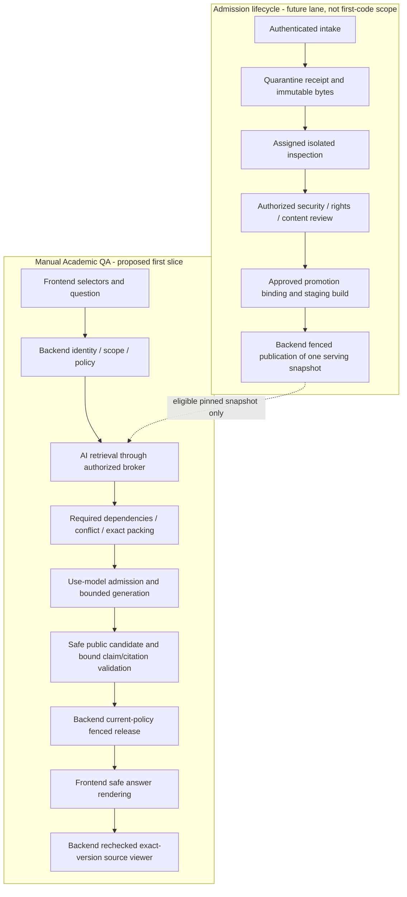
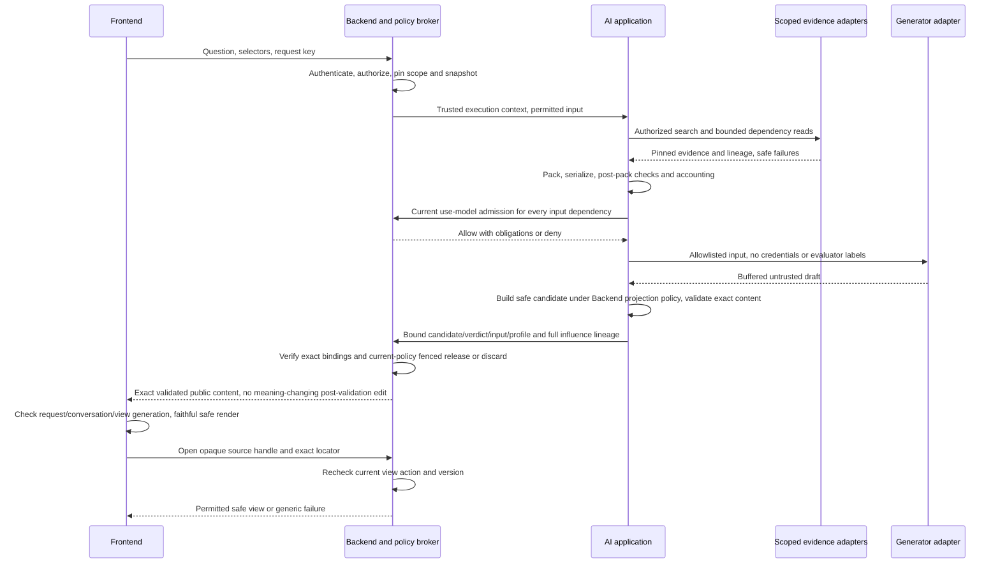

# WP-04 — AI Core workflow: ASTRA-01 review packet v0.1

2026-09-07, repair revision v0.1.1. **Review draft, chưa triển khai hoặc explicit product GO.** Ba findings của lượt read-only review trong hội thoại được xử lý ở [repair/handoff 39](../evaluation/39-wp04-repair-recovery-handoff-v0.1.md); re-review là cùng assistant, không tự chứng nhận reviewer độc lập/Astra acceptance. Người dùng đã đồng ý scope Academic QA manual, structured text-first/visual-limited. [Scope record](../harness/WP02-WP04-reconciliation.md) không cấp quyền dùng nguồn, gọi model hoặc phát hành. Gate đã thông báo: `Đã tới ASTRA-01: cần review AI Core workflow`.

Đọc cùng [test map](../evaluation/37-wp04-behavior-security-review-v0.1.md) và [review guide](../roadmap/04-astra-review-guide-v0.1.md). Packet đề xuất orchestration để reviewer tìm lỗ hổng; không là schema đã freeze hoặc hướng dẫn bỏ qua gate.

## 1. Phạm vi và nguồn quyết định

Đích lát cắt đầu sau đúng GO: câu hỏi khái niệm/so sánh → đủ nguồn thì giải thích → claim-citation → mở đúng nguồn. Controlled multi-step, một vai trò suy luận chính; Academic/Learning/Hub không tự trở thành ba agents. Không router đa mode, autonomous tool loop, upload UI, OCR production, index writer hoặc triển khai cloud trong first-code slice.

Khởi đầu dự kiến với domain/application ports và fake/in-memory adapters trên synthetic fixtures có quyền rõ. Fake generator kiểm orchestration chứ không đo khả năng trả lời của model. Auth fake chỉ là test double, không bảo vệ dữ liệu thật. Real adapters là task/gate riêng sau tests và các quyết định liên quan; không lấy GO của fake slice làm GO toàn sản phẩm.

Thứ tự authority: yêu cầu user/AGENTS → master plan → corrected boundary contracts/clarification → đề xuất trong packet. Các contracts nền: [authorization](../../contracts/authorization-context.md), [content-unit/index](../../contracts/content-unit-index.md), [evidence packet](../../contracts/evidence-packet.md), [AI facade](../../contracts/ai-core.md), [HTTP boundary](../../contracts/http-api.md), [quarantine](../../contracts/quarantine-manifest.md). Nếu packet mâu thuẫn, ghi finding và sửa draft có review; không âm thầm thay contract.

## 2. Hai luồng và ba trust boundaries

Boundary 1: client selectors/question không tạo trusted identity. Boundary 2: source/OCR/title/metadata/model output không là policy hoặc instruction authority. Boundary 3: nội bộ, model input và public result là ba projections riêng; evaluator labels nằm ngoài cả model và serving data. In-process calls không tự là sandbox; real adapter credentials phải least privilege.

Admission lane giữ nguyên [secure upload](../governance/05-secure-upload-quarantine-deduplication-v0.1.md): minimal receipt + immutable tenant blob trước, không extracted content/embedding vào serving. Exact bytes có thể reuse storage trong tenant nhưng mỗi submission giữ provenance/rights riêng; near similarity chỉ candidate. Inspector chỉ exact assignment, no egress/tools, restricted sink; known forbidden secret/bomb không tiếp tục generic parse. Không có reviewer → pending, không tự approve hoặc giả đã gửi hàng đợi cho giáo viên.

Promotion phải có exact source/review/revision binding; staged build pin lexical/dense/graph/representations. Backend mới được activate một serving manifest hoàn chỉnh qua guarded compare-and-set cùng ordering của revoke/publication. Indexer không tự publish. Build fail không tác động snapshot trước nếu snapshot đó vẫn được phép; rollback cũng kiểm current admission. Luồng này là yêu cầu review cho tích hợp tương lai, không lý do triển khai writer ngay.

## 3. Proposed query states và outcomes

Tên dưới đây là vocabulary review, **không enum/API freeze**. Một request có execution outcome riêng với response behavior và evidence status; timeout không ép thành `refuse` hoặc `unanswerable`.

| State | Owner / điều kiện vào | Kết quả và nhánh ra |
|---|---|---|
| Q0 Receive | Backend xác thực caller, bind request identity, validate kích thước và selectors | Scope ambiguity hợp lệ → clarify; identity/policy không hợp lệ → generic deny; không search trước quyền |
| Q1 Authorize and pin | Backend/PDP quyết một active tenant, per-resource bindings, action/purpose, profile và serving snapshot | Missing/expired/stale/unavailable → deny hoặc operational failure an toàn; chỉ allow đi tiếp |
| Q2 Understand and constrain | AI application dùng question + history đã lọc quyền, Academic manual policy | Pure greeting/verified FAQ có thể template; mixed/follow-up vẫn giữ task học thuật; graded-work → hỗ trợ khái niệm/clarify/hint theo policy; không tự mở tool mới |
| Q3 Retrieve | Authorized broker thực thi prefilter trước candidate scoring/hydration trên pinned surfaces | Candidate lineage hợp lệ → Q4; no-hit → insufficient trong scope đã tìm; mismatch snapshot → operational/integrity failure, không mix index |
| Q4 Build evidence bundles | AI đánh giá dependencies/known authorized conflicts với resource checks từng target | Required closure đủ → bundle; thiếu/denied/cyclic/too-large → dependent claims incomplete. Repair chỉ trong scope/budget; không mở denied neighbor |
| Q5 Serialize and assess | AI tạo exact model-input projection, đo accounting, xác nhận post-pack fidelity/closure | Unknown budget/invalid lineage → block; đủ cho full hoặc independent supported subset → Q6; không có claim đủ → safe limitation không cần generation |
| Q6 Admit model use and generate | Backend/broker recheck `use_in_model_context` + processing/egress obligations cho mọi dependency; generator chỉ nhận allowlist projection | Draft chỉ ở internal buffer; timeout/cancel/error → không phát draft; không external provider fallback |
| Q7 Validate public candidate | Safe canonical candidate theo Backend-owned projection policy trước AI semantic/integrity/citation validation; verdict bind exact candidate/draft/packet/input/influence/profile revisions | Accepted full/partial candidate → Q8; mutation/sanitizer mất nghĩa → verdict invalid, sửa và revalidate trong budget; hết budget → validation failure |
| Q8 Release | Backend kiểm exact verdict/content bindings và current quyền/obligations trên **toàn influence set**; fenced release admission | Mất quyền bất kỳ influence item → discard toàn draft; changed public content không được dùng verdict cũ. Muốn sinh lại cần new assessed packet và validation; không chỉ xóa citation |
| Q9 Terminal and view | Backend commit terminal outcome; frontend kiểm request/conversation/view generation rồi faithful safe render; viewer là request/action độc lập | Callback view cũ không render/cache/history append; exact version/locator + current view rights. Public không lộ existence ngoài quyền |

Evidence influence set gồm source items/history-derived protected context thực sự gửi model hoặc dùng trong draft; phải truy vết đầy đủ. Không truy được provenance của protected history thì bỏ/làm rõ, không tin text answer trước như nguồn mới. Public warnings không nêu ID/title/count/existence của denied resources.

Terminal families đề xuất: completed với full/partial/clarification/hint hoặc safe scope/policy response; insufficient evidence; denied; operational failure; validation failure; cancelled. Response behavior, reason và evidence coverage là trục khác nhau. No-hit không chứng minh corpus không có đáp án; thiếu conflict assessment không chứng minh các nguồn thống nhất. Các tên public code cụ thể chờ schema review.

## 4. Sequence và revocation ordering

Diagram rút gọn các deny/cancel edges; mỗi protected operation cần enforcement độc lập. **Recheck rồi send không đủ để đóng race.** Review requirement là một authoritative ordering/fencing mechanism giữa revoke commit và protected-operation admission tại model submission, delivery và viewer release. Operation ordered sau effective revoke không được release; operation trước revoke vẫn phải recheck ở boundary tiếp theo. Không giữ DB lock suốt cuộc gọi model; design thực cần chứng minh serialization point, stale token fencing và bounded admission, không dùng epoch field đơn thuần như proof.

Model admission là barrier dùng cho **mọi** model invocation, không chỉ Q6: nếu Q2 dùng model để hiểu intent hoặc Q7 dùng semantic judge, chúng cũng phải được cấp `use_in_model_context`/processing authority cho exact input, lọc history, kiểm egress, finite budget và current revisions trước dispatch. First fake slice dùng test doubles, không tự thêm LLM ở hai bước đó. Question do user gửi cũng chịu data-processing policy, không mặc định mọi nội dung user nhập được gửi ra provider. Không truyền raw draft/source sang một judge external như đường vòng generation gate.

Network arrival không là ordering point; không thể thu hồi bytes đã gửi hợp lệ trước revoke, kể cả tới provider. Nghĩa vụ retention/egress được kiểm **trước** gửi. Nếu chưa có adapter cung cấp semantics này thì không tích hợp dữ liệu protected thật. Fake interleaving tests chỉ kiểm yêu cầu, không chứng minh hệ phân tán đã enforce. Cancel cũng cần ordering với final release: cancel thắng trước release → không phát body; release đã commit → không hứa thu hồi, trả trạng thái thực khi có quyền xem.

## 5. Public ports và ownership

WP04-F01/F03 clarification: [evidence §4.1](../../contracts/evidence-packet.md) là contract exact validation-to-release binding; [HTTP request/view binding](../../contracts/http-api.md) chặn late response sau tenant/conversation/session switch. Hash không chứng minh quyền hoặc semantic render fidelity. Current obligations làm đổi nội dung phải new candidate/revalidate hoặc fail; không sửa sau verdict. Backend sở hữu projection policy và persistence target gốc, AI kiểm semantics, Frontend chỉ render profile bảo toàn nghĩa và drop stale callbacks.

Các operation logic dưới đây không phải Python signatures hoặc network-service mandate. Entry/adapters → application → domain; infrastructure implements ports. Không private imports xuyên component.

| Public boundary / port | Authority / producer | Input tối thiểu → output | Không được làm |
|---|---|---|---|
| QA facade | Backend caller → AI application | trusted execution reference + permitted question/profile → draft/outcome + internal lineage | AI không mint scope, HTTP DTO hoặc approve |
| Policy/effect broker | Backend/PDP | authenticated run/action/exact bindings/current revision → per-operation decisions/obligations | Model arguments không tự là quyền; PDP unavailable không allow |
| Serving catalog | Backend publication authority | requested permitted scope → immutable complete manifest | Store alias/metadata không là ACL truth |
| Evidence search/read | AI algorithm, infrastructure qua authorized broker | query + prefilter handle + pinned snapshot → per-item locators/quality/source refs | Không global search rồi chỉ postfilter; no staging/quarantine fallback |
| Dependency/conflict lookup | AI + scoped graph adapter | exact anchors/versions + bounded traversal → required/optional/unknown relations, safe missing reasons | Similarity/adjacency không tự thành required truth; relation không cấp quyền |
| Serializer/accounting | AI | selected bundles + generator profile → exact input, internal hash/usage, omissions | Không lấy qrels vào input, không giữ ID rồi cắt mất content mà báo đủ |
| Generator | AI adapter bị broker giới hạn | allowlisted model input + deadline/cancel/output constraints → untrusted buffered draft | Không direct DB credentials, publish/share/web/tool autonomy |
| Validator | AI deterministic + semantic validation profile | exact safe candidate/packet/draft/input/influence/citation/profile bindings → bound verdict + reasons/revision | Không lấy verdict model tự khai; ID/hash không chứng minh semantic support/render fidelity |
| Result/release ledger | Backend | scoped request attempt + exact candidate/verdict/influence set → terminal record/release decision ở conversation gốc | Replay không bypass current auth hoặc dùng UI selector mới làm persistence target; raw prompts không public |
| Citation viewer | Backend | opaque handle + user/session/current action → exact version/region safe view | Handle/URL không là credential; không chuyển version âm thầm |
| Telemetry sink | Each component → restricted audit owner | minimal stage/decision references/counts → trace events | Không raw capability/source/PII/model reasoning trong public logs |

## 6. Chunking, visual limits và claim-conflict policy

Các rules này áp dụng ở pack/query boundary, không tuyên bố đã có automatic dependency discovery:

- Preserve atom/reading order và lineage của heading, negative lead-in, code prologue, table header/blank/units, formula/image bindings. Known required closure đi cùng anchor; optional chỉ dùng phần budget còn lại. Unknown dependency state không tự thành complete.
- Một claim có thể cần nhiều fragments/locators (AND); alternate evidence chỉ đạt khi một alternative đủ tất cả parts (OR). Chunk IDs không thay evidence reference. Contiguous fragments có thể cover requirement nếu exact serialization giữ nghĩa.
- Full compare A/B chỉ khi đủ required support của cả hai. Chỉ A đủ thì giải thích A và nêu giới hạn; mất B sau packing không được sửa bằng memory. Repair fetch/repack trong quyền, không đổi source version cho vừa budget.
- Text-first không flatten PDF: lưu locator/dependency/availability của visual; không suy số/đường/dấu từ caption hoặc điền ô bài tập. Independent text claim có thể trả dù claim visual khác incomplete; không loại visuals khỏi intake/reference denominator.
- Known authorized conflict cần giữ các phía phù hợp. Unresolved → source-attributed disagreement/partial hoặc abstain phần tranh chấp, không top-1 majority. Not-assessed có thể trả source-attributed fact theo query policy nhưng không claim consensus; adjudication/comparison thiếu phía không được full pass.
- Model-generated caption là auxiliary derived representation, không source citation. Denied targets không lộ trong warnings; qrels/reference labels là evaluator-only, không dùng oracle để chọn retrieval hoặc đánh giá runtime đủ evidence.
- Human review là deferred review need, không giữ request mở vô hạn hoặc hứa đã gửi giáo viên. Khi chưa reviewer, không tự resolve conflict/content rights; nếu về sau tạo review ticket, Backend kiểm assignment và data minimization riêng.

## 7. Retry, idempotency, cancellation và partial results

Đề xuất để Astra review: **first fake slice không automatic model retry, không semantic cache, không stream answer tokens trước validation**. Đây là lựa chọn giảm số trạng thái của slice, chưa production profile đã được user ký. Progress events nếu cần chỉ metadata an toàn, không source text/token draft; transport chưa chọn.

| Tình huống | Semantics đề xuất |
|---|---|
| Same scoped request key, same canonical payload/profile | Backend ledger trả pending hoặc terminal operation identity; không tạo call kép. Trả body cũ phải recheck influence set/current policy; ledger không phải quyền đọc |
| Same key nhưng question/mode/scope/conversation khác | Conflict/invalid request; không trả body của request trước. Key namespace bind subject + active tenant + action; canonical payload bind conversation gốc; fingerprints server-only, không global existence oracle |
| Client retry sau disconnect/timeout | Check operation status trước; nếu completion unknown, không tự tạo generation mới. Model nondeterminism không được gọi là exactly-once; invocation/effect IDs riêng |
| Transient read failure | Chỉ retry nếu profile có finite attempts/time/resources còn lại, giữ snapshot và scope; mỗi attempt current auth. Không retry deny, invalid schema, missing rights, classified forbidden hoặc canceled work |
| Missing context | Repair chỉ yêu cầu evidence cụ thể/authorized closure trong budget; không lặp retrieve/generate vô hạn hoặc nâng K qua prompt nguồn. Mỗi repack có identity/hash mới, tái validation |
| Invalid answer/citation | Không phát draft, không sửa citation ngẫu nhiên. Profile repair nếu được review phải quay qua exact packing/accounting/validation và charge toàn cost; failure khi hết budget |
| Cancel/late callback | Propagate cancellation; mark attempt generation/fence không còn deliverable. Callback muộn không resurrect terminal state hoặc overwrite attempt mới; best-effort provider stop không hứa không bị tính phí |
| Một nhánh fail nhưng phần khác đủ | Chỉ phát partial nếu subset độc lập đã validate toàn bộ, được policy cho và còn quyền; kèm safe limitation. Protected evidence revoke sau generation → discard toàn draft, không redaction ad hoc |

Storage durability, lock/CAS mechanism, replay retention, exact request key format và retry policy phải review trước real adapters. First in-memory ledger không là cross-process durable exactly-once. Không đưa side-effecting tools vào primary reasoning role; admission/index jobs dùng identity/lease/fencing riêng, không tái dùng query retry semantics để publish.

## 8. Budget ledger — chưa chọn số production

Một reviewed execution profile phải có đầy đủ finite limits trước run, không mặc định unlimited khi null. Unknown budget là configuration/not-ready failure, không evidence insufficiency. Mọi call/retry/repair đều debit chung request ceiling và stage ceiling.

| Nhóm | Phải pin/đo | Khi thiếu hoặc vượt |
|---|---|---|
| Generator | exact model/revision, tokenizer/accounting profile, context capacity, input/output limits; wrappers/history/tools/image accounting; safety reserve nếu áp dụng | Không model call thật nếu chưa biết fit; không truncate ngầm |
| Embedding | BGE-M3 research revision/tokenizer, input limit/profile; bytes/text checksum, normalization và truncation policy | Oversized critical atom giữ explicit unsupported/split policy đã review, không silent cut |
| Retrieval/index | candidate K từng surface, rerank candidates, owner partitions, max fetched bytes/units, pinned build profiles và queue/concurrency quotas | Không mở rộng ngoài scope; snapshot mismatch fail; counts bao gồm rejected/pending |
| Dependency/pack | hops, visited nodes, cycles, required closure size, serialized tokens, omitted anchors và reasons | Optional bỏ trước required; required không fit → dependent claims incomplete |
| Time/calls | end-to-end deadline, per-stage deadline, max attempts/repair/tool calls, tenant/user rate/concurrency | Stop/cancel safely; callback muộn không release; không biến thành no knowledge |
| Parser/visual future | file/page/object/decompressed bytes, pixels/rotation/render profile, CPU/RAM/time, allowed formats | Quarantine/review, không provider fallback hoặc tăng resources theo instructions trong PDF |
| Cost/egress | authorized compute/provider ceiling, permitted data categories/destination/retention, retries và failed calls | No egress khi thiếu decision; no paid calls để tự chọn ceiling |

Generator constraint: exact accounted input + reserved output phải nằm trong effective capacity theo model profile; thêm các giới hạn riêng input/output khi provider quy định. Không cộng BGE tokens với generator tokens hoặc coi ảnh miễn phí. Con số 2.048, K=2/3 từ nghiên cứu cũ **không** là mặc định production. Test fake dùng finite fixture-specific limits được khai báo trong từng test, không gọi là benchmark model.

## 9. Telemetry và first causal failure

Trace server-side theo stage/attempt với request/run/parent-event IDs, snapshot/profile revisions, operation ordering/fence references, decision references, dependency/influence lineage references, stage start/end/status, counts/budget debit, permitted omission categories. Không raw credentials, hidden reasoning, source text hoặc full provider errors. Subject/resource metadata cũng protected; public chỉ safe correlation/status, không index namespace hoặc deny-target counts.

First causal failure là **stage sớm nhất có bằng chứng vi phạm requirement**, kèm proof-event references và confidence/unknown; giữ riêng downstream symptoms và cuối response outcome. Không suy mọi partial từ retrieval: nếu input representation đã thiếu dấu thì parser/representation là nguyên nhân trước; nếu retrieved đủ nhưng serialized mất units thì packing. Concurrency dùng causal ordering, không chỉ sort wall-clock. Thiếu trace → unknown/invalid evaluation, không bịa root cause.

Mỗi unique exposure incident có một identity, nhiều AUTH/IX/UPL tags; không đếm thành nhiều incidents. Operational failures eligible vẫn trong denominator/cost. Audit sink failure tại protected boundary phải có durable admission evidence hoặc fail closed theo profile; logging dashboard không được coi là enforce authorization.

## 10. Dependency candidates và supply-chain review

First fake slice đề xuất stdlib/in-memory, không orchestration framework bắt buộc. Không cài gì trong WP-04. Catalog sau chỉ là ứng viên của adapter tương lai, **không chọn winner hoặc quyền chạy**; license label upstream không xác nhận corpus rights hay toàn dependency tree.

| Candidate | Upstream evidence kiểm 2026-09-07 | Data implications / chưa chốt |
|---|---|---|
| BGE-M3 + FlagEmbedding | Model card ghi MIT; code library MIT: [model card](https://huggingface.co/BAAI/bge-m3/blob/main/README.md), [library license](https://github.com/FlagOpen/FlagEmbedding/blob/master/LICENSE) | Giữ local research baseline; model/library/tokenizer artifact revisions và dependency licenses phải pin riêng; không gửi ACL/secret/eval labels vào embeddings |
| pypdf, native-text candidate | [Upstream license](https://github.com/py-pdf/pypdf/blob/main/LICENSE): BSD-style three-clause terms | Local adapter candidate, không chứng minh semantic layout/OCR fidelity; quyền parse và sandbox vẫn cần. Không chọn nó chỉ vì license |
| Tesseract, future OCR candidate | [Upstream license](https://github.com/tesseract-ocr/tesseract/blob/main/LICENSE): Apache-2.0 | Engine và language/model data phải inventory riêng; không có reviewed Vietnamese scan benchmark ở repo; chưa cho OCR quarantine run mới |
| Generator, semantic validator/judge, reranker, store/auth/web framework | Chưa chọn exact artifacts/releases; license/retention review pending | Không dùng mặc định SDK/provider; local và external có threat/retention/cost khác nhau, cần task lựa chọn riêng |

URLs branch/main là upstream observations, không reproducible dependency lock. Trước install: pin release/commit + artifact hash, transitive licenses/notices, provenance/vulnerability review, telemetry/egress defaults, model loading/code execution behavior, offline cache origin và rollback plan. Không tự chạy remote repository code hoặc chấp nhận terms thay người dùng. Chưa dependency/supply-chain acceptance.

## 11. Quyết định cần Astra và người dùng review

| Ref | Proposal/open question | Latest blocker |
|---|---|---|
| WPD-01 | Manual text-first scope đã đồng ý; no prevalidated token stream, no semantic cache, no autonomous tools và no automatic model retry ở fake slice là proposals | Trước scoped product GO |
| WPD-02 | Required dependency discovery và runtime answerability không có gold leakage; unknown dependencies/semantics không tự complete | Fake fixtures kiểm contracts; real discovery/semantic gates trước model quality claims/real serving |
| WPD-03 | Authoritative ordering/fences cho model submission, release, viewer, revoke/cancel; full influence set, exact verdict binding và client view generation | WP04-F01/F03 corrected draft; fake schedules trước adapter, real proof trước protected data |
| WPD-04 | Three projections, validated public candidate/render fidelity, view/conversation binding, result axes và ledger | WP04-F01/F03 corrected draft; exact schema/profile cần chốt trước phần implementation tương ứng |
| WPD-05 | Exact generator/validator/tokenizer, finite budget and retry profile, license/egress | Trước model/real adapter run; không chặn read-only review |
| WPD-06 | Rights owners, reviewed sources, label authority/matching/calibration và graded-work policy | Trước sử dụng/claim tương ứng; chưa giáo viên thì không gold hoặc tự approve |
| WPD-07 | Product work harness sau GO: profile hiện không authorize runtime | Cần separate reviewed maintenance task bound actual review/GO record; không thêm approved=true hoặc relabel runtime là research |

DR-02..10 từ [review 35](../evaluation/35-wp02-decision-review-v0.1.md) tiếp tục mở; DR-01 chỉ đóng user scope choice. [Repair 39](../evaluation/39-wp04-repair-recovery-handoff-v0.1.md) ghi ba actual conversation findings và affected-scope self-review, không phải external reviewer acceptance. WP04-F02 tách C-04 resolver/CI-02b post-pack trong scorer/test map. [Recovery design](../governance/06-material-deletion-recovery-v0.1.md) bổ sung future lifecycle lane, không mở rộng exact first fake QA slice. User vẫn cần xem revision/dispositions và explicit scoped GO; tài liệu đầy đủ không giải quyết mọi open question.
