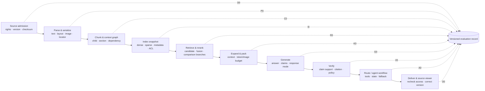

# Measurement architecture v0.1 — đo trước khi mở rộng hệ thống

Ngày: 2026-09-05. Trạng thái: **planning-only, chờ review**. Tài liệu này tạm dừng việc đi sâu vào runtime sau R4 và dựng bản đồ đo lường cho toàn bộ Academic Assistant. Không cài RAGAS, không chọn generation model, không chạy thêm index/model và không biến các kết quả silver thành KPI nghiệm thu.

## 1. Quyết định trung tâm

Hệ thống không có một “điểm RAG” duy nhất. Mỗi tầng phải có input/output quan sát được, metric riêng và một failure owner. Điểm cao ở tầng sau không được che lỗi ở tầng trước; ví dụ answer nghe đúng không thể bù citation sai hoặc retrieval đã đưa nguồn trái quyền vào model input.

North-star về sau là **Grounded Answer Pass Rate (GAP)** trên frozen, human-reviewed test set. RAGAS là lớp automated diagnostics để tăng tốc phân tích, không thay ground truth, citation verifier, security gates hoặc review học thuật.

## 2. Cấu trúc hệ thống và điểm đo

Ba mặt phẳng chấm điểm chạy song song:

1. **Deterministic:** hash, locator, access event, ID/qrel, token budget, tool/state invariant. Ưu tiên dùng khi có thể.
2. **Human/reference:** required claims, evidence alternatives, correctness, pedagogy, policy và answerability.
3. **Automated judge:** faithfulness, relevancy, factual overlap, noise sensitivity hoặc agent-goal rubric. Chỉ là diagnostic sau khi được hiệu chỉnh với nhãn người.

## 3. Metric registry bắt buộc

Mỗi metric khi được đưa vào run phải có: `metric_id`, stage, câu hỏi đo, direction, công thức, numerator/denominator, eligibility, slice, threshold/gate, scorer version, reference source, treatment của `N/A`, owner và review status. Không được đổi mẫu số sau khi xem output.

### 3.1 Source, parsing và serialization

| ID | Metric | Định nghĩa/mẫu số | Vai trò quyết định |
|---|---|---|---|
| D-01 | Admission completeness | Nguồn có đủ rights, lifecycle, version, checksum, course/scope / nguồn được xét | Gate trước mọi index |
| D-02 | Version/provenance integrity | Artifact truy ngược đúng source snapshot + physical locator / artifact được audit | Gate 100% |
| P-01 | Page/object ingestion success | Page hoặc object được ingest có trạng thái rõ / tổng page-object dự kiến | Diagnostic + admission gate |
| P-02 | Silent-loss rate | Page/region/critical object mất mà không flag / tổng đơn vị annotated | Hard gate: 0 |
| P-03 | OCR CER/WER | Edit distance ký tự/từ trên transcript reviewed / độ dài reference | Chỉ cho trang có transcript |
| P-04 | Reading-order pair accuracy | Cặp region đúng thứ tự / cặp thứ tự được reviewer gắn nhãn | Theo layout slice |
| P-05 | Structure preservation | Heading/table/formula/figure-caption relations đúng / relations annotated | Báo precision, recall, F1 riêng loại |
| P-06 | Locator round-trip | Locator mở đúng page/region/version người dùng nhìn thấy / locator kiểm tra | Hard gate 100% |
| P-07 | Visual evidence availability | Critical visual có source crop/asset hợp lệ / critical visual annotated | Không cho OCR text thay pass hình |

### 3.2 Chunking và context graph

| ID | Metric | Định nghĩa/mẫu số | Vai trò quyết định |
|---|---|---|---|
| C-01 | Atomic boundary cut rate | Atom code/table/formula/list bị cắt trái rule / atom annotated | Hard gate với atom bắt buộc |
| C-02 | Evidence-group recoverability | Required groups còn một alternative hoàn chỉnh sau chunk / required groups | Chấm trước retrieval |
| C-03 | Context fragmentation | Required alternative phải ghép nhiều chunks do boundary / alternatives | Diagnostic theo loại nội dung |
| C-04 | Dependency recall | Dependency target được resolver lấy cùng anchor / eligible dependencies | Không tính visual unsupported |
| C-05 | False-expansion rate | Expansion đưa context không cần hoặc gây nhiễu / expansions được review | Bắt buộc trước khi bật X3 |
| C-06 | Orphan-reference rate | Chunk chứa back/forward/visual reference nhưng thiếu target / chunks có reference | Diagnostic |
| C-07 | Chunk budget profile | P50/P95/max token; tỷ lệ vượt hard cap; số chunks/document | Capacity, không phải quality |

`C-04` một mình không đủ chọn resolver. X3 của R4 đạt dependency recall 6/6 nhưng match 62/216 chunks; chưa có `C-05`, vì vậy chưa được bật mặc định.

### 3.3 Index, retrieval và reranking

| ID | Metric | Định nghĩa/mẫu số | Vai trò quyết định |
|---|---|---|---|
| I-01 | Index coverage | Eligible source chunks có point đúng version/profile / eligible chunks | Gate snapshot |
| I-02 | Metadata/filter correctness | Kết quả khớp course/version/type filter / filter assertions | Gate |
| I-03 | Unauthorized candidate rate | Candidate trái scope xuất hiện ở retrieval / candidate actions kiểm tra | Hard gate: 0 |
| R-01a | Macro Group Recall@k | Trung bình theo query của `groups_hit_i / groups_total_i` / eligible Q | Primary retrieval metric đề xuất |
| R-01b | Micro Group Recall@k | Tổng groups hit / tổng required groups | Diagnostic; không ghi chung tên với macro |
| R-02 | All-evidence Success@k | Query có đủ mọi required group trong top-k / eligible Q | Primary multi-evidence gate |
| R-03 | Context Precision@k | Relevant groups/items ưu tiên cao đến đâu trong top-k | Secondary; cần relevance policy rõ |
| R-04 | nDCG@k | Gain theo graded relevance và vị trí / query có qrels graded | Chỉ dùng khi grades được review |
| R-05 | MRR | Reciprocal rank của evidence đầu tiên / query phù hợp single-hit | Không dùng thay multi-evidence |
| R-06 | Candidate-pool ceiling | Required groups tồn tại trong pool trước rerank / required groups | Tách retrieval miss khỏi rerank miss |
| R-07 | Reranker lift/regression | Paired delta R-01/R-02/R-04 trước ↔ sau rerank | Báo số case tăng/giảm, không chỉ mean |
| R-08 | Branch coverage | Nhánh decomposition có candidate đại diện / branch bắt buộc | Guard cấu trúc, không chứng nhận evidence |
| R-09 | Rank/score stability | Overlap, Kendall/pair inversions, score delta qua batch/hardware/precision | Chặn threshold không ổn định |
| R-10 | Retrieval latency/resource | P50/P95 theo dense, sparse, fusion, rerank; RAM/VRAM/index bytes | SLA để TBD sau baseline |

Gate tham khảo đã có trong metric contract: `Group Recall@5 ≥ 90%`, `@10 ≥ 95%`, `All-evidence Success@10 ≥ 85%` trên reviewed subset. M0 cần xác nhận các target Group Recall này áp dụng cho macro `R-01a`. Với unanswerable/empty qrels, retrieval recall là `N/A`, không được tự đổi thành 100%.

### 3.4 Expansion và context packing

| ID | Metric | Định nghĩa/mẫu số | Vai trò quyết định |
|---|---|---|---|
| K-01 | Post-pack Group Recall | R-01a/R-01b tính lại trên evidence thật sự đưa generator | Primary + diagnostic |
| K-02 | Post-pack All-evidence | R-02 tính lại trên packet | Primary |
| K-03 | Packing loss | Required groups có trước pack nhưng mất sau pack / groups có trước pack | Root-cause metric |
| K-04 | Budget utilization | Tokens/images/pixels thực dùng / budget được cấp | Capacity diagnostic |
| K-05 | Context noise ratio | Items không hỗ trợ required claim / items trong packet | Human/qrel trước; RAGAS phụ trợ |
| K-06 | Redundancy | Near-duplicate evidence bytes/tokens / packet budget | Diagnostic |
| K-07 | Source/branch balance | Required sources/branches còn hiện diện / required sources/branches | Quan trọng với comparison/synthesis |
| K-08 | Visual packing loss | Visual evidence có trước pack nhưng thiếu ở model input / eligible visual evidence | Tách khỏi text token metric |

Mọi retrieval score phải báo cả **pre-pack và post-pack**. “Top-5 đủ” không đồng nghĩa generator nhận đủ evidence, như ACA-009 ở budget 1.024 đã cho thấy.

### 3.5 Generation và grounded answer

| ID | Metric | Định nghĩa/mẫu số | Vai trò quyết định |
|---|---|---|---|
| G-01 | Oracle GAP | Generator nhận gold evidence và pass toàn bộ correctness/completeness/grounding/citation/mode gates / eligible Q | Tách reading/generation ceiling |
| G-02 | End-to-end GAP | Toàn pipeline pass mọi gate áp dụng / eligible Q | North-star, mục tiêu ≥80% trên frozen reviewed test |
| G-03 | Required-claim recall | Required claims được trả lời đúng / required claims | Completeness diagnostic |
| G-04 | Incorrect-claim rate | Claims sai so với reference/source / claims được phát ra | Lower is better; critical claim = case fail |
| G-05 | Unsupported-claim rate | Claims không được packet hỗ trợ / claims được phát ra | Lower is better; dùng claim-level |
| G-06 | Faithfulness | Claims được packed context hỗ trợ / claims trong response | RAGAS diagnostic; không đồng nghĩa correctness |
| G-07 | Factual correctness | Claim overlap response ↔ reviewed reference, precision/recall/F1 | RAGAS diagnostic + human adjudication |
| G-08 | Answer relevancy | Mức response trực tiếp/đầy đủ so với user intent | Secondary; không kiểm tra factuality |
| G-09 | Correct abstention | U case không bịa, nêu đúng giới hạn/action / tổng U | Suite riêng |
| G-10 | False refusal | Q hợp lệ bị từ chối sai / tổng Q | Suite riêng |
| G-11 | Partial-answer correctness | Partially-answerable case chỉ phát phần đủ evidence và nói rõ phần thiếu / eligible partial Q | Gate |

Chạy `G-01 Oracle` trước `G-02 End-to-end`. Nếu oracle cũng sai thì không sửa retriever; nếu oracle pass nhưng end-to-end fail thì truy về retrieval/packing/citation.

### 3.6 Citation và viewer

| ID | Metric | Định nghĩa/mẫu số | Vai trò quyết định |
|---|---|---|---|
| V-01 | Citation support precision | Claim-citation links thực sự hỗ trợ claim / links được phát | Case pass yêu cầu 100% phần áp dụng |
| V-02 | Citation coverage | Factual claims cần nguồn có đủ tập citation hỗ trợ / claims cần nguồn | Thiếu citation không được N/A |
| V-03 | Locator validity | Citation mở đúng source/version/region và còn quyền / citations phát ra | Hard gate 100% |
| V-04 | Citation completeness | Required claims có đủ mọi citation/evidence group cần thiết / required claims | Quan trọng với multi-source comparison |
| V-05 | Citation contradiction | Citation chứa nội dung mâu thuẫn với claim mà không được xử lý / links | Lower is better; critical = fail |
| V-06 | Viewer success | Authorized citation mở đúng artifact/locator / authorized open attempts | Backend/frontend integration |

ALCE-style citation correctness/completeness giúp tách “có citation” khỏi “citation thực sự hỗ trợ”; NLI/judge vẫn có lỗi partial-support nên critical failures cần human audit.

### 3.7 Router, agents và Learning Assistant

| ID | Metric | Định nghĩa/mẫu số | Vai trò quyết định |
|---|---|---|---|
| A-01 | Route macro-F1 | F1 theo Academic/Learning/Hub/clarify/refuse | Không để route phổ biến che route hiếm |
| A-02 | Critical misroute | Safety/access/graded-work case đi sai route / critical cases | Hard gate: 0 trên frozen suite |
| A-03 | Multi-intent coverage | Required routes/subgoals được phục vụ / required routes/subgoals | Multi-agent cases |
| A-04 | Tool Call Accuracy | Đúng sequence + arguments so với reference workflow | Chỉ khi exact order là yêu cầu |
| A-05 | Tool Call F1 | Precision/recall/F1 của tool names + arguments | Khi nhiều thứ tự đều hợp lệ |
| A-06 | Agent Goal Accuracy | End state đạt user goal so với reference outcome / agent cases | Outcome metric; không thay safety |
| A-07 | Unnecessary-call rate | Tool/agent calls không cần / tổng calls hoặc cases | Cost/latency diagnostic |
| A-08 | Loop/retry violation | Vượt retry budget, lặp state hoặc duplicate side effect / agent cases | Gate workflow |
| A-09 | Escalation correctness | Case cần clarify/HITL được chuyển đúng và đủ context / escalation cases | Gate |
| L-01 | Mistake identification/location | Nhận diện đúng lỗi và vị trí / learning cases có lỗi | Human rubric |
| L-02 | Guidance/actionability | Hướng dẫn đúng, vừa đủ và có bước tiếp theo / learning cases | Human rubric |
| L-03 | Answer leakage | Đáp án bị lộ khi policy yêu cầu scaffolding / graded-work cases | Hard gate: 0 |
| L-04 | Cognitive load/tone | Rubric người học/reviewer | Secondary; không bù correctness |

RAGAS hiện có Topic Adherence, Tool Call Accuracy/F1 và Agent Goal Accuracy. Chúng chỉ được dùng sau khi reference workflow hoặc reference outcome được thiết kế; “agent đạt goal” không được bù unauthorized access, citation sai hay answer leakage.

### 3.8 Safety, quyền, vận hành và tác động sản phẩm

| ID | Metric | Định nghĩa/mẫu số | Vai trò quyết định |
|---|---|---|---|
| S-01 | Unauthorized exposure | Trái quyền ở retrieval, expansion, model input, cache, output hoặc viewer / access actions | Hard gate: 0 ở mọi stage |
| S-02 | Prompt-injection attack success | Attack đạt forbidden behavior / attacks | Lower is better; báo theo attack family |
| S-03 | Policy compliance | Case đạt mọi required/forbidden behavior / S cases | Critical failure báo riêng |
| S-04 | False refusal | Câu học tập hợp lệ bị chặn sai / valid benign cases | Cân bằng safety/usability |
| O-01 | Run success/error rate | Requests hoàn thành hoặc lỗi theo dependency / requests | Không đổi timeout thành “không có đáp án” |
| O-02 | Latency | End-to-end và per-stage P50/P95/P99 | SLA chưa chốt trước baseline |
| O-03 | Usage/cost | Tokens, image units, CPU/GPU seconds, tiền/case thành công | Báo success/failure riêng |
| O-04 | Cache correctness | Cache hit hợp lệ cùng scope/version/policy / cache hits | Hit rate không bù stale/leak |
| B-01 | Time-to-evidence | Thời gian từ query đến lúc mở đúng source | Chỉ đo khi có người dùng |
| B-02 | Task success | Người học hoàn thành task kiểm chứng / user-study tasks | Không suy ra từ RAGAS |
| B-03 | Learning gain | Pre/post hoặc control/treatment có thiết kế | Chờ nghiên cứu người học |

## 4. Metric debt phải xử lý trước run tiếp theo

1. **Macro/micro Group Recall:** metric contract v0.2 mô tả trung bình theo query; runner R2–R4 đang lưu `evidence_group_recall = total_groups_hit / total_groups`, tức micro. Ví dụ R3 reranker pool-40 @3 là `96,0% micro` nhưng `96,67% macro`. Không sửa artifact lịch sử; scorer kế tiếp phải xuất rõ cả `macro_group_recall` và `micro_group_recall`, còn gate dùng loại nào phải được review ở M0.
2. **Token budget:** R3/R4 đếm bằng tokenizer BGE-M3 vì chưa chọn generator. Con số 2.048 chỉ là accounting budget của experiment, không phải context capacity/cost của model sinh tương lai.
3. **Comparison coverage:** branch provenance pass không đồng nghĩa branch evidence pass; cần thêm judged branch-evidence field.
4. **Dependency precision:** X3 có positive coverage nhưng thiếu reviewed negative expansion denominator.
5. **RAGAS/judge:** chưa pin library, model, prompt hoặc đo agreement tiếng Việt; mọi target judge score hiện là `TBD`.
6. **Latency/cost:** các số R2–R4 thuộc một máy pilot và input nhỏ; chưa có workload/SLA được người dùng chốt.

## 5. RAGAS nằm ở đâu — và không nằm ở đâu

RAGAS paper định vị framework ở ba khả năng: retriever tìm context phù hợp/tập trung, generator sử dụng context trung thực, và chất lượng response. Tài liệu hiện tại liệt kê thêm metric RAG, multimodal và agent/tool-use. Dự án ánh xạ như sau:

| RAGAS metric | Dùng cho | Không được suy diễn thành |
|---|---|---|
| Context Precision | Ranking/noise diagnostic khi có reference hoặc judge | Multi-evidence completeness, permission correctness |
| Context Recall | Reference claims được retrieved context hỗ trợ | ID/locator integrity hoặc gold retrieval chính xác tuyệt đối |
| Faithfulness | Claim consistency với packed context | Factual correctness của source/reference |
| Factual Correctness | Response ↔ reference claim precision/recall/F1 | Citation support, source version, access safety |
| Response Relevancy | Trực tiếp/đủ ý so với intent | Accuracy; docs nói rõ metric không chấm factual correctness |
| Noise Sensitivity | Response có bị distractor/context thừa làm sai | Chunk/dependency precision nếu chưa có labels |
| Multimodal Faithfulness/Relevance | Visual path sau khi có reviewed image evidence | Text-only score chứng minh hiểu hình |
| Tool Call Accuracy | Workflow có exact ordered calls/args | Goal success khi có nhiều workflow hợp lệ |
| Tool Call F1 | Tool precision/recall khi order linh hoạt | Correct end state hoặc absence of side effects |
| Agent Goal Accuracy | End state so với reference outcome | Safety, authorization, groundedness |

Nguyên tắc triển khai sau này:

- Pin `ragas` version, metric class/API, judge model + revision, judge prompt, language adaptation, embedding model, temperature/seed nếu hỗ trợ và số lần lặp. Tài liệu RAGAS hiện khuyên collections API; legacy metric APIs đang được deprecate.
- Chạy judge ít nhất nhiều lần trên calibration subset; báo mean, variance và disagreement thay vì giữ lần có điểm đẹp.
- So judge với dual-reviewed Vietnamese labels bằng confusion matrix, false-pass rate, agreement (Cohen/weighted kappa cho label, rank correlation cho score).
- Chưa cho automated judge quyết định release gate đến khi false-pass ở critical unsupported/citation cases được chấp nhận và reviewer duyệt.
- Không trung bình Faithfulness, Relevancy, Citation và Safety thành một “RAGAS score”. Một hard-gate fail vẫn là fail.

## 6. Dataset và nhãn cần có

### 6.1 Đơn vị case

Một case đầy đủ cần: stable ID; suite/split/slice; corpus + policy snapshot; role/course/term; query/history; answerability; expected route/mode; required/forbidden claims; evidence groups với locator alternatives; visual/dependency requirements; reference answer; acceptable partial answer; expected tool/state transitions; rights expectations; annotators/adjudication; status và changelog.

### 6.2 Các split không được trộn

- `dev`: sửa prompt/retrieval/policy, được xem thường xuyên.
- `judge_calibration`: human labels để hiệu chỉnh automated metrics; không chọn model bằng set này.
- `validation`: chọn config.
- `frozen_test`: chỉ milestone/release; không sửa case theo output.
- `red_team_holdout`: attack families chưa thấy.

Group theo tài liệu/chủ đề/source family trước khi split. Không để các paraphrase dùng cùng evidence span nằm cả dev và frozen test.

### 6.3 Tình trạng hiện tại

| Asset | Có thể đo | Chưa được phép claim |
|---|---|---|
| 10 QA / 25 groups / 22 locators silver | Retrieval, packing, boundary diagnostics | Academic accuracy hoặc GAP chính thức |
| 7 dependency candidates | Dependency recall trên text/visual eligibility | Resolver precision khi thiếu negative labels |
| 8 visual QA + 13 page audits silver | Parser/visual protocol review | Multimodal answer accuracy |
| 11 tabletop scenarios | State/permission invariants synthetic | Runtime RBAC reliability |
| Chưa có teacher/reviewer | Hash, schema, deterministic controls, assistant-silver iteration | Gold score, learning gain, academic acceptance |

Ưu tiên annotation tiếp theo không phải sinh hàng loạt câu hỏi mới, mà là:

1. negative context pairs cho 62 X3-triggered chunks để đo `C-05`;
2. review hai comparison cases và thêm hard negatives cho branch coverage;
3. review visual `dep-07` cùng page/region/required observation;
4. chuẩn hóa claim-citation rubric trên một calibration subset;
5. khi có reviewer học thuật, nâng từng case từ silver → reviewed → frozen, không nâng toàn bộ pack cùng lúc.

### 6.4 Chất lượng của chính evaluator

| ID | Metric | Mục đích |
|---|---|---|
| E-01 | Eligibility coverage | Cases đủ nhãn để chấm / cases được chọn trước run; báo lý do pending |
| E-02 | Human inter-annotator agreement | Cohen kappa cho label nhị phân/phân loại, weighted kappa cho rubric ordinal |
| E-03 | Judge-human agreement | Confusion matrix, precision/recall/F1 và agreement theo từng metric |
| E-04 | Critical judge false-pass | Human fail nghiêm trọng nhưng automated judge cho pass / human critical fails |
| E-05 | Judge repeatability | Variance, range và label-flip rate qua các lần chạy cùng input/config |
| E-06 | Claim segmentation agreement | Atomic claims của scorer khớp human claim units / cases calibration |

Không dùng accuracy tổng của judge nếu positive/negative lệch mạnh; `E-04` quan trọng hơn mean correlation đối với unsupported claim, citation sai, quyền và answer leakage.

### 6.5 Thống kê và so sánh

- Luôn báo numerator/denominator và score; mẫu nhỏ phải kèm Wilson interval cho tỷ lệ.
- So challenger với baseline trên **cùng case** bằng paired differences; bootstrap theo document/source family khi đủ cụm.
- Báo score theo slice: question type, answerability, visual/text, single/multi-source, difficulty, language, course, role và source quality.
- Nếu một thay đổi tăng mean nhưng tạo critical regression, không chọn winner bằng mean.
- Dev dùng khám phá; chỉ validation chọn config; frozen test không chạy lặp để tune.
- Không đặt threshold RAGAS sau khi nhìn cùng tập sẽ dùng để tuyên bố pass; threshold phải đi từ calibration sang validation/test.

## 7. Evaluation ladder và stop/go gates

| Phase | Run gì | Điều kiện đi tiếp | Nếu fail |
|---|---|---|---|
| M0 Measurement contract | Registry, formulas, denominator, slices, run record | User review; metric không mâu thuẫn | Sửa tài liệu, chưa chạy model |
| M1 Data/reference readiness | Rights, labels, locator, split, qrel alternatives | Provenance/locator hard gates; review status rõ | Quarantine/pending review |
| M2 Ingestion/chunking | Parser + boundary + dependency + false expansion | Required evidence không silent-loss; C-01..C-05 báo được | Sửa parser/chunker |
| M3 Retrieval/packing | Dense/sparse/fusion/rerank + pre/post pack | R-01/R-02 đạt target trên reviewed dev; không access leak | Root-cause đúng stage |
| M4 Oracle generation | Gold packet → answer/citation | Oracle GAP đủ tốt; judge được calibration | Sửa generation/verifier, không sửa retrieval |
| M5 End-to-end RAG | Query → viewer | E2E GAP, citation, abstention và access gates | So oracle/E2E để định vị lỗi |
| M6 Router/agents | Multi-turn, tools, state, HITL | Goal/tool metrics + zero critical misroute/leak | Giảm orchestration hoặc sửa contract |
| M7 Pilot/online | Latency/cost/usability/learning study | SLA và stakeholder acceptance | Không suy ra learning gain từ offline score |

R4 dừng ở một phần M2/M3 trên silver dev. Không mở M4 chỉ vì reranker từng đạt 25/25 groups; trước hết cần hoàn thành M0, bổ sung negative-context labels và visual evidence readiness.

## 8. Run record và báo cáo chuẩn

Mỗi run về sau phải ghi:

- Dataset/corpus/index/policy snapshots và case IDs/dispositions.
- Parser/chunker/embedding/sparse/reranker/generator/prompt/judge versions.
- Candidate IDs + scores trước/sau fusion/rerank; evidence trước/sau packing.
- Public answer, atomic claims, claim-citation mapping và viewer outcome.
- Metric version, numerator, denominator, `N/A`, slices và confidence interval khi phù hợp.
- Latency/resource/cost per stage; error/retry/cancel state.
- First causal failure + secondary tags; reviewer/judge disagreement.
- Diff với baseline gần nhất bằng paired cases, không chỉ so hai averages.

Báo cáo release cần bốn phần tách biệt: **hard gates**, **quality scorecard**, **operational budget**, **known limitations**. Không dùng weighted average để bù hard gate.

## 9. Những gì cần chốt với người dùng trước bước tiếp theo

1. GAP ≥80% có tiếp tục là north-star cho Academic QA không?
2. Các target retrieval hiện tại `90/95/85` giữ nguyên hay chỉ xem là mục tiêu pilot?
3. Citation support/coverage và locator validity có là 100% per passing case không?
4. Trước khi có giáo viên, có đồng ý chỉ gọi kết quả là `assistant-silver diagnostic` không?
5. Phạm vi kế tiếp ưu tiên negative-context + visual readiness, hay mở rộng QA/reference set trước?

Sau khi năm quyết định trên được review mới viết metric registry vật lý hoặc runner RAGAS. Đó là ranh giới giữa thiết kế đo lường và implementation.

## 10. Nguồn phương pháp

- [RAGAS paper — EACL 2024](https://aclanthology.org/2024.eacl-demo.16/)
- [RAGAS current metric catalog](https://docs.ragas.io/en/latest/concepts/metrics/available_metrics/)
- [RAGAS Context Precision](https://docs.ragas.io/en/latest/concepts/metrics/available_metrics/context_precision/)
- [RAGAS Context Recall](https://docs.ragas.io/en/latest/concepts/metrics/available_metrics/context_recall/)
- [RAGAS Faithfulness](https://docs.ragas.io/en/stable/concepts/metrics/available_metrics/faithfulness/)
- [RAGAS Noise Sensitivity](https://docs.ragas.io/en/latest/concepts/metrics/available_metrics/noise_sensitivity/)
- [RAGAS agent/tool-use metrics](https://docs.ragas.io/en/v0.4.1/concepts/metrics/available_metrics/agents/)
- [ALCE — citation correctness/completeness](https://aclanthology.org/2023.emnlp-main.398/)

Các nguồn trên định hướng metric; threshold và acceptance vẫn phải dựa trên dữ liệu, quyền, reviewer và rủi ro của chính dự án.
