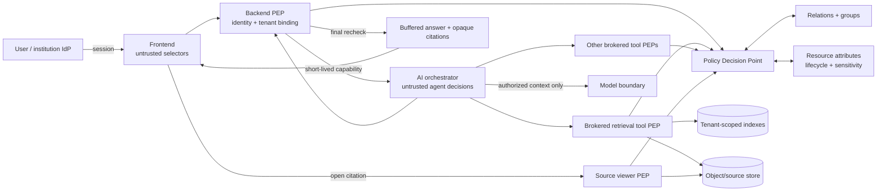

# Kiến trúc phân quyền Zero Trust đa tổ chức v0.1

Ngày cập nhật: 2026-09-05

Trạng thái: **blueprint để review, chưa được triển khai hoặc kiểm thử runtime**. Tài liệu này mở rộng [permission matrix v0.1](01-permission-matrix.md), [vòng đời tài liệu](02-document-lifecycle.md) và [authorization context contract](../../contracts/authorization-context.md).

## 1. Vấn đề cần giải quyết

Khi hệ thống mở cho nhiều trường, tổ chức ngoài và tài khoản tự do, một lần kiểm tra role ở API gateway là không đủ. Dữ liệu có thể rò ở candidate retrieval, parent/image expansion, prompt gửi model, tool call của agent, cache, log, citation hoặc source viewer dù answer cuối đã bị chặn.

Mục tiêu an toàn là:

> Không user, service hay agent nào được nhìn, suy luận, đưa vào model, trích dẫn, tải hoặc biến đổi tài nguyên ngoài đúng tenant, quan hệ, mục đích và action đã được cấp tại thời điểm sử dụng.

Các ranh giới bắt buộc:

- `tenant` là security boundary gốc; course chỉ là scope con, không thay tenant.
- source text, PDF, ảnh, metadata và prompt đều là dữ liệu không tin cậy; chúng không thể tự cấp quyền.
- agent là một **untrusted deputy**, không phải security principal toàn năng và không phải Policy Decision Point.
- quyền quản trị control plane khác quyền đọc content plane.
- thiếu identity, tenant, action, resource, policy version hoặc trạng thái hiện tại thì fail closed.
- search/retrieval phải lọc quyền **trước similarity/ranking**; post-filter answer không sửa được việc dữ liệu đã lọt vào model.

## 2. Threat model

### 2.1 Tác nhân

- free user thử đoán `tenant_id`, `course_id`, `material_id`, citation handle hoặc query để dò tên tài liệu.
- user hợp lệ của Trường A thử đọc Trường B; sinh viên Course A thử đọc Course B.
- thành viên vừa bị gỡ quyền nhưng session, cache, index hoặc agent run vẫn còn sống.
- giảng viên/curator vượt scope được phân công hoặc tự duyệt tài liệu của mình.
- platform admin kỹ thuật thử dùng quyền vận hành để đọc nội dung mật.
- tài liệu hoặc website chứa indirect prompt injection yêu cầu agent tìm, ghép hoặc xuất tài liệu khác.
- agent, tool hoặc peer agent bị lỗi/hallucinate và gửi resource ID ngoài scope.
- background job dùng snapshot/policy cũ; vector point đã revoke vẫn còn trong index.
- link chia sẻ bị chuyển tiếp; signed URL, cache key, log hoặc trace trở thành bearer secret.

### 2.2 Tài sản phải bảo vệ

- file gốc, text/OCR, ảnh, bảng, chunk, embedding và index payload.
- tên tài liệu, course membership và metadata có thể tự nó đã nhạy cảm.
- prompt/context, answer draft, citation, source preview, download và export.
- agent memory, tool result, cache, telemetry, audit và backup.
- identity relation, policy, encryption key và reviewer/evaluator artifacts.

### 2.3 Không nằm trong giả định tin cậy

- role, tenant, course hoặc resource ID do frontend/user gửi.
- ACL/sensitivity nằm trong PDF, HTML hoặc metadata từ crawler/uploader.
- lời model nói rằng một action “an toàn” hoặc “được phép”.
- opaque ID, URL khó đoán, vector namespace hoặc system prompt đứng riêng lẻ.
- qrels/oracle/evaluator sidecar; chúng không được đưa vào runtime để quyết định quyền hay trả lời.

## 3. Mô hình quyền: RBAC + ReBAC + ABAC

RBAC trả lời “principal đang giữ vai trò gì”; ReBAC trả lời “principal có quan hệ gì với object”; ABAC trả lời “action có hợp lệ với thuộc tính subject/object/environment/purpose hiện tại không”. Cả ba đều cần thiết.

Quy tắc tổng quát:

```text
ALLOW = authenticated
    AND exactly_one_active_tenant
    AND trusted_membership_or_share_relation
    AND role_allows_action
    AND relation_allows_action_on_resource
    AND purpose_is_allowed
    AND lifecycle_is_servable
    AND sensitivity_clearance_is_sufficient
    AND environmental_conditions_pass
    AND capability_is_current
    AND no_explicit_deny
```

`explicit deny` luôn thắng; không có rule allow rõ ràng là deny. Không cộng dồn ngầm quyền từ hai tenant hoặc hai role session khác nhau.

### 3.1 Principal

| Loại | Ví dụ | Quy tắc |
|---|---|---|
| Human | free user, student, lecturer, curator | Mỗi request bind đúng một active tenant; role có thời hạn |
| Workload | ingestion worker, index publisher, viewer service | Identity riêng theo workload; không dùng shared admin key |
| Agent run | tutor run, learning-planner run, hub-search run | Identity dẫn xuất ngắn hạn, action/tool/budget hẹp hơn user |
| Break-glass session | sự cố được duyệt | Có lý do/ticket, step-up, hết hạn, cảnh báo và audit bất biến |

Một user có thể thuộc nhiều tổ chức, nhưng mỗi request và agent run chỉ có một `active_tenant_id`. Chuyển tenant tạo security context mới; không tái dùng retrieval result, memory hay cache từ context cũ.

Free user mặc định thuộc personal tenant riêng và chỉ thấy:

- dữ liệu chính họ sở hữu;
- public catalog đã được duyệt;
- share invitation đích danh mà họ đã xác nhận.

Nhập một domain email, tenant ID hoặc tên trường không tự tạo membership. Membership tổ chức chỉ đến từ invitation/provisioning/federation đã xác minh.

### 3.2 Resource hierarchy

```text
platform
├── public_catalog
└── tenant
    ├── organization_unit
    ├── course_or_project
    │   └── collection
    │       └── material
    │           └── material_version
    │               ├── representation
    │               ├── chunk_or_region
    │               └── image_or_attachment
    ├── agent_run_and_memory
    ├── evaluation_artifact
    └── audit_stream
```

Mỗi row/object/vector/cache record phải mang `tenant_id` đáng tin cậy và immutable sau khi tạo; các derivative còn mang resource/version/lineage ID. Child không được đổi tenant khác parent. Quyền parent có thể truyền xuống theo policy, nhưng explicit deny hoặc sensitivity ở child luôn có thể thu hẹp.

### 3.3 Quan hệ

Các quan hệ logic tối thiểu:

- `tenant#member`, `tenant#org_admin`, `tenant#security_admin`;
- `course#student`, `course#lecturer`, `course#owner`, `course#reviewer`;
- `material#owner`, `material#contributor`, `material#viewer`, `material#approver`;
- `share#recipient` và `group#member` có thời hạn;
- `agent_run#on_behalf_of` và `agent_run#permitted_tool`.

Ví dụ quan hệ, chỉ để giải thích model chứ chưa phải schema:

```text
course:ctdl#student@user:u123
material:m42#parent@course:ctdl
material:m42#viewer@course:ctdl#student
material:exam-final#viewer@group:exam-committee#member
agent_run:r9#on_behalf_of@user:u123
```

Không lưu một danh sách ACL user khổng lồ trong từng vector point. Vector chỉ giữ identity/attributes của resource; effective access phải được policy layer giải từ quan hệ hiện tại.

### 3.4 Sensitivity và admission

| Mức | Ví dụ | RAG/model policy mặc định |
|---|---|---|
| `public` | học liệu được phép công khai | Có thể dùng trong public catalog sau review |
| `tenant_internal` | tài liệu chung nội bộ trường | Chỉ tenant member có action phù hợp |
| `course_restricted` | giáo trình/lab theo lớp | Cần quan hệ course còn hiệu lực |
| `staff_restricted` | ghi chú nghiệp vụ giảng viên | Không cho student; không suy từ course membership |
| `assessment_confidential` | đề/đáp án chưa mở | Chỉ nhóm đích danh; không vào tutor corpus |
| `pii_or_research_sensitive` | hồ sơ cá nhân/dữ liệu nghiên cứu | Dedicated policy, retention và data plane khi cần |
| `secret_forbidden` | API key, credential, private key | Quarantine; không OCR/embed/index/model-context |

Lifecycle và sensitivity là hai trục độc lập. Chỉ resource `published` và được admission cho đúng purpose mới vào serving index. `draft`, `in_review`, `archived`, `rejected`, `quarantined` bị loại khỏi student retrieval ngay cả khi relation cũ còn tồn tại.

Clarification 2026-09-06: `secret_forbidden` ở đây là classification đã biết. Unknown upload có thể được isolated inspector kiểm tra local theo [inspection-lane policy](05-secure-upload-quarantine-deduplication-v0.1.md#restricted-inspection-khác-serving), không gửi ra ngoài hoặc cấp cho learner agent. Các action inspection có authority/sink riêng; sau khi phát hiện secret phải chặn downstream và giữ security quarantine.

### 3.5 Action và purpose tách nhỏ

Không dùng một quyền `read` bao trùm. Policy ít nhất phải phân biệt:

- `discover_metadata`, `search`, `read_excerpt`, `view_source`, `download`;
- `use_in_model_context`, `cite`, `transform`, `ocr`, `embed`, `index`;
- `upload`, `edit_metadata`, `submit_review`, `approve`, `publish`, `archive`;
- `share`, `export`, `manage_grants`, `read_audit_metadata`, `read_audit_content`.

Purpose tối thiểu gồm `learn`, `teach`, `review`, `curate`, `evaluate`, `operate`. Quyền dùng nội dung để học không mặc nhiên cho phép export, download, train model hoặc đưa vào evaluation dataset.

## 4. Trust boundaries và complete mediation



Backend là policy enforcement point (PEP) ở public boundary; một Policy Decision Point (PDP) dùng identity, relations, attributes và policy hiện hành để trả quyết định. AI core không tự tạo scope, không nhận IdP token/admin credential và không quyết định publish/grant.

Policy decision logic tối thiểu trả:

- `allow|deny` và reason code không chứa dữ liệu nhạy cảm;
- `decision_id`, `policy_version`, `authorization_epoch`;
- obligations: redaction, no-download, watermark, step-up, max rows/chunks;
- expiry và resource/snapshot constraints.

PDP unavailable hoặc input thiếu thì protected resource fail closed. Public catalog chỉ được phục vụ từ snapshot đã ký/xác minh, không tự fallback sang tenant corpus.

## 5. Capability dành cho AI/agent

Backend đổi session rộng thành capability hẹp cho đúng một operation. Logical fields được chốt ở [authorization context contract](../../contracts/authorization-context.md); representation cụ thể (opaque token hay integrity-protected envelope) sẽ chọn khi triển khai.

Capability phải bind ít nhất:

- subject/workload/agent-run, active tenant, audience và purpose;
- action/tool allowlist;
- resource roots hoặc digest của authorized resource filter;
- material/index snapshot, policy version và authorization epoch;
- request/run ID, nonce, issued/expiry time, usage/budget constraints.

Capability không được:

- đưa vào prompt, tool result, log, frontend hoặc citation;
- là wildcard cross-tenant cho user-facing agent;
- sống lâu hơn session hoặc tiếp tục sau revoke/tenant switch;
- cấp agent nhiều quyền hơn giao của user, agent policy và tool policy.

Mọi tool kiểm tra capability và action/resource độc lập. Resource ID do model sinh ra chỉ là input không tin cậy. Prompt injection có thể điều khiển ý định của model nhưng không thể vượt PEP nếu complete mediation đúng.

## 6. Các checkpoint bắt buộc

| Điểm | Điều phải kiểm tra | Lý do |
|---|---|---|
| Request admission | identity, active tenant, purpose, rate/plan | Chặn spoofing và free-user abuse |
| Query planning | tool allowlist, requested action | Agent không tự mở rộng năng lực |
| Candidate retrieval | tenant + resource filter trước BM25/vector search | Candidate trái quyền không được tồn tại |
| Parent/image expansion | recheck từng dependency/version | Child hợp lệ không suy ra parent/image hợp lệ |
| Context serialization | `use_in_model_context` + obligations | Không gửi dữ liệu mật sang model |
| Mỗi tool call | agent-run capability + current policy | Chặn confused deputy/excessive agency |
| Cache lookup/write | scope digest + epoch + snapshot | Chặn cache xuyên tenant/quyền cũ |
| Pre-delivery | recheck mọi evidence dependency | Chặn revoke giữa run |
| Citation minting | `cite`, opaque handle, expiry | Citation không trở thành bearer credential |
| Source view/download | current viewer/download policy | Revoke vẫn có tác dụng sau answer |
| Ingest/index job | workload identity, material version, purpose | Job cũ không index nhầm nguồn |
| Publish/index alias | reviewer approval + separation of duties | AI/worker không tự đưa nguồn vào production |

Upload còn có pre-lifecycle quarantine boundary: raw file chỉ tạo minimal receipt/hash/state và immutable tenant quarantine blob; chưa được ghi content DB, embedding queue hoặc serving index. Parser chạy sandbox; duplicate resolution và promotion là action riêng. Xem [secure upload/dedup policy](05-secure-upload-quarantine-deduplication-v0.1.md).

Answer đầu tiên nên buffer đến khi pre-delivery gate qua. Nếu stream sớm, mỗi segment phải gắn lineage và chỉ phát sau authorization/citation validation tương ứng; chưa có protocol đó thì không stream content học thuật.

## 7. Chống stale authorization và TOCTOU

- Mọi thay đổi membership, share, lifecycle, sensitivity hoặc policy tăng `authorization_epoch` thích hợp.
- Decision/capability/cache có TTL ngắn nhưng TTL không thay revocation check.
- Recheck current epoch trước model input, side effect, delivery, source view và download.
- Index/search result mang resource version; stale point bị reject dù vector store chưa xóa xong.
- Background job pin version/snapshot, nhưng phải recheck admission trước publish output.
- Khi revoke giữa run: dừng fetch/tool mới, hủy answer buffer, không ghi semantic cache; audit phần đã xử lý. Nội dung user đã nhìn thấy trước revoke không thể “unsee”.
- Policy/relations cần consistency token hoặc minimum revision để một check sau revoke không đọc replica cũ. Thiết kế này chưa chọn authorization engine nhưng không chấp nhận eventual consistency không ràng buộc ở đường phát dữ liệu.

## 8. Isolation dữ liệu đa tenant

### 8.1 Ba mức triển khai

| Tier | Phạm vi | Isolation dự kiến |
|---|---|---|
| Public | corpus đã duyệt công khai | Data plane/index/cache riêng với tenant corpus |
| Standard tenant | trường/tổ chức thông thường | Shared service nhưng mandatory tenant partition, DB RLS/constraint, tenant-scoped index/object/cache và key context |
| Regulated/dedicated | PII/nghiên cứu/đối tác yêu cầu cao | Dedicated database/index/object namespace, encryption key và có thể network boundary riêng |

Tier là deployment choice, không thay policy. Shared data plane phải có defense in depth; chỉ truyền `tenant_id` trong query không được coi là isolation.

### 8.2 Invariants

- storage path, database row, object metadata, vector payload, index alias, cache entry và backup catalog đều có tenant lineage.
- query bắt buộc có tenant partition được lấy từ trusted context; không lấy từ prompt.
- vector search prefilter trước similarity; batch query không gom nhiều tenant trừ job platform được phê duyệt và không đưa kết quả vào user context.
- embeddings được coi nhạy cảm như source; không dùng embedding tenant A làm negative/sample/cache cho tenant B.
- backup/restore/export/delete phải giữ hoặc xóa đủ toàn bộ derivative, gồm OCR, chunk, embedding, image crop và cache.
- cross-tenant collaboration dùng share/grant object đích danh hoặc publish một version vào controlled shared catalog; không “nhảy namespace” bằng raw ID.

Clarification 2026-09-06: active tenant của request và owner tenant của source là hai field khác nhau. Public/named-share access được bound bằng exact resource/version/action/purpose/publication-or-share revision trong [authorization contract](../../contracts/authorization-context.md#resource-ownership-và-request-tenant). Prefilter chỉ truy cập các partition được PDP cấp; public/tenant items được hợp ở packet bằng lineage riêng. Tenant switch không tự chuyển quyền hoặc cache.

## 9. Agent và tool security

- Mỗi agent profile có tool allowlist cố định; read-only mặc định.
- Không cấp shell, arbitrary URL fetch, raw database/vector/object-store access cho learner-facing agent.
- URL-fetch nếu có phải qua broker với allowlist, DNS/IP/redirect/size/type controls để chống SSRF và exfiltration.
- Agent run có giới hạn time, token, tool-call count, rows/chunks, recursion và egress destination.
- Tool side effect dùng action hẹp, idempotency key và human confirmation/approval khi impact cao.
- Agent không được `approve`, `publish`, `manage_grants`, đọc audit content hoặc tự nâng capability.
- Agent memory bind tenant + subject + conversation + purpose + retention; không dùng shared hidden memory xuyên tenant.
- Dữ liệu từ source/peer agent giữ provenance và trust label. Instructions nằm trong source không được chuyển thành system/tool instruction.
- Model output được coi không tin cậy; backend kiểm tra locator, permission, output schema và disclosure trước delivery.
- Tutor, retrieval, review/publish và permission administration là các duties tách biệt; không hợp nhất thành một “super agent”.

## 10. Quản trị đặc quyền và chia sẻ ngoài tổ chức

### 10.1 Admin không phải content reader

- platform admin quản lý availability/config/account ở control plane, không mặc định đọc tenant content.
- org admin quản lý membership/policy của tổ chức nhưng không mặc định đọc `assessment_confidential` hoặc `pii_or_research_sensitive`.
- break-glass content access cần step-up authentication, ticket/lý do, phạm vi cụ thể, thời hạn ngắn, cảnh báo chủ dữ liệu và audit chống sửa.
- nên có dual approval cho break-glass mức cao, export hàng loạt, thay policy nhạy cảm và cross-tenant share.
- người upload/chỉnh một version không tự approve/publish chính version đó; người quản lý audit không đồng thời có quyền xóa audit.

### 10.2 External share

- recipient phải authenticate; share bind đích danh recipient/tenant, version, actions, purpose và expiry.
- mặc định `view_source` không kéo theo `download`, `share` hoặc `use_in_model_context`.
- link/citation chỉ là opaque lookup handle; không phải permanent bearer URL.
- revoke share tăng epoch và vô hiệu cache/viewer; forwarded link không cấp quyền cho người nhận khác.
- export có manifest/lineage/watermark theo policy và audit; agent không được tự quyết export.

## 11. Identity và session baseline

- Hỗ trợ local/free account trước; federation OIDC/SAML và group provisioning là phase sau, không tự động tin verified email domain.
- privileged action yêu cầu MFA/step-up; ưu tiên phishing-resistant authenticator khi triển khai.
- OAuth/OIDC dùng authorization-code flow với PKCE, exact redirect matching, issuer/audience validation; không dùng implicit flow.
- access token audience/scope tối thiểu; workload dùng identity riêng và rotation, không dùng credential chung trong frontend/model/tool prompt.
- session switch tenant phải rotate security context và xóa state/cache UI nhạy cảm của tenant trước.
- error cho unauthorized object không tiết lộ object có tồn tại; quy tắc `404/403` phải nhất quán và được test chống enumeration.

## 12. Cache, log và model provider boundary

Cache key/validation tối thiểu gồm:

```text
tenant + subject_or_policy_scope_digest + action + purpose
+ policy_version + authorization_epoch + corpus/index snapshot
+ resource versions + model/tool/prompt version
```

- không semantic-cache raw answer xuyên tenant; public cache chỉ nhận dependency 100% public.
- authorize trước khi hydrate và recheck dependency trước khi phát cache hit.
- raw prompt/context, credential/capability, PII và restricted source text không vào log mặc định.
- audit chứa actor/run, tenant, action, resource reference, allow/deny, reason, decision/policy/epoch, stage và timestamp; access audit cũng được phân quyền.
- nếu dùng model/OCR/VLM bên ngoài, admission policy phải xét data residency, retention, training opt-out, region và sensitivity trước `use_in_model_context`; `secret_forbidden` không bao giờ được gửi.

## 13. Failure semantics

Các nhóm lỗi contract cần phân biệt mà không tiết lộ object:

- `authentication_required`;
- `tenant_context_required` hoặc tenant mismatch;
- `access_denied`;
- `step_up_required`;
- `policy_unavailable` — fail closed;
- `capability_expired_or_replayed`;
- `resource_revoked_or_version_changed`;
- `isolation_invariant_violation` — mở security incident, không retry mù;
- `agent_action_not_permitted`.

Retry chỉ được phép sau khi có security context mới hoặc với action idempotent; agent không tự thử resource khác để né deny.

## 14. Metrics và hard gates

Định nghĩa metric chi tiết sẽ nối vào measurement registry; các gate sau là bắt buộc trước pilot có user thật:

| ID | Metric | Mẫu số / cách đo | Gate |
|---|---|---|---|
| AUTH-01 | Cross-tenant false allow | mọi adversarial action A→B và B→A | **0** |
| AUTH-02 | Unauthorized exposure by stage | candidate, expansion, model input, tool, cache, output, viewer, export | **0 ở từng stage** |
| AUTH-03 | Authorization checkpoint coverage | protected actions đã có decision/audit / toàn bộ protected actions | **100%** |
| AUTH-04 | Retrieval prefilter compliance | search có trusted tenant/resource prefilter / protected searches | **100%** |
| AUTH-05 | Stale authorization acceptance | action allow sau revoke/epoch change / probes | **0** |
| AUTH-06 | Cache isolation failure | cache hit sai tenant/scope/policy/version / probes | **0** |
| AUTH-07 | Agent/tool policy bypass | tool action ngoài capability thành công / attack attempts | **0**; block rate 100% |
| AUTH-08 | Secret-forbidden admission | canary vượt forbidden sink hoặc known-secret tiếp tục generic OCR/embed/index/model; authorized isolated inspection báo riêng | **0**, clarification-v0.1.1 |
| AUTH-09 | Audit completeness | protected/privileged decisions có record hợp lệ / decisions | **100%** |
| AUTH-10 | Revocation propagation latency | revoke commit → các PEP đều deny, p95/p99/max | threshold chốt sau prototype; false allow vẫn 0 |
| AUTH-11 | Policy decision latency | p50/p95/p99 theo checkpoint/batch size | budget hiệu năng, không được bỏ check để đạt latency |
| AUTH-12 | False deny | authorized action bị deny / authorized probes | theo dõi usability; không gộp để bù false allow |
| AUTH-13 | Enumeration leakage | khác biệt response/timing lộ object ngoài quyền / probes | 0 finding nghiêm trọng |
| AUTH-14 | Privileged/break-glass use | số lần, scope, duration, missing approvals | 100% đúng workflow/audit |

RAGAS không đo bất kỳ gate authorization nào. Một answer faithful vẫn thất bại tuyệt đối nếu một chunk trái quyền đã vào context.

## 15. Security test corpus tối thiểu

Tạo hoàn toàn bằng synthetic/private fixtures, ít nhất hai tenant A/B có tên course/material gần nhau:

1. user đoán raw ID, sửa tenant/course/resource trong URL/body/header;
2. exact-title query và semantic paraphrase cố kéo tài liệu tenant khác;
3. BM25/vector/hybrid/reranker trả stale point sau archive/revoke;
4. authorized child nhưng unauthorized parent, image, table hoặc attachment;
5. cache do lecturer/tenant A tạo rồi student/tenant B gửi cùng câu;
6. membership/share bị revoke ở trước retrieval, trước model, trước delivery và trước viewer;
7. policy replica cũ, PDP timeout và capability replay;
8. indirect prompt trong PDF bảo agent gọi tool/export/search tenant khác;
9. model sinh resource ID tenant khác hoặc tool args bị tamper;
10. peer agent gửi hidden context/trust label giả;
11. admin/org admin đọc content khi không có content grant;
12. uploader tự approve; approver đổi content rồi tự publish;
13. forwarded external share, expired invite và recipient mismatch;
14. hidden metadata/title/timing/error enumeration;
15. secret/PII canary qua OCR, embedding, prompt, output, log và telemetry;
16. backup/restore/delete/export giữ hoặc phá tenant lineage;
17. background indexing job tiếp tục sau revoke/version replacement;
18. multi-tenant batch/analytics vô tình ghép rows hoặc embeddings.

Test theo bốn tầng:

- policy unit + deny-by-default/property/mutation tests;
- component integration với data stores/index/cache thật nhưng synthetic;
- concurrency/TOCTOU/chaos khi revoke hoặc policy store lỗi;
- agent red-team và end-to-end disclosure canary.

Không dùng pilot PDF đang quarantine làm security fixture và không gọi kết quả tabletop hiện tại là chứng nhận runtime authorization.

## 16. Lộ trình triển khai sau khi duyệt

### Phase A — freeze policy semantics

- chốt tenant/resource/action/purpose/sensitivity/lifecycle vocabulary;
- chốt role conflicts, inheritance, explicit deny và external-share semantics;
- tạo synthetic tenant A/B policy fixtures và expected decision table;
- review [authorization context contract](../../contracts/authorization-context.md).

Exit: mọi action/resource có owner và deny outcome rõ; chưa cần chọn vendor/engine.

### Phase B — authorization spike độc lập AI

- prototype identity → PEP → PDP → datastore/index filtered search;
- chứng minh prefilter, current revision, revoke và source viewer;
- đo AUTH-01..06, 09..13; fault injection PDP unavailable.

Exit: hard gates đạt trên fixture; AI/model chưa cần chạy.

### Phase C — capability và agent sandbox

- broker retrieval/tools bằng run capability hẹp;
- áp tool allowlist/budget/egress, prompt-injection và canary suite;
- kiểm tra context serialization, cache, citation và delivery.

Exit: AUTH-02/07/08 đạt ở mọi stage; không có direct datastore credential trong agent.

### Phase D — privileged workflow và federation

- separation of duties, step-up, break-glass, external share;
- sau đó mới tích hợp IdP/group sync cho một trường pilot;
- dedicated isolation profile cho tổ chức có dữ liệu regulated.

Exit: audit/incident/revocation drills được owner tổ chức ký duyệt.

## 17. Quyết định đã chốt và còn mở

Đã chốt ở mức kiến trúc:

- Zero Trust/complete mediation; RBAC thuần không đủ.
- tenant là root boundary; free user có personal tenant.
- admin không mặc định là content reader.
- agent không phải PDP; mọi tool được broker và authorize độc lập.
- filter trước retrieval, recheck trước model/delivery/viewer.
- citation/link không là bearer capability; cache/embedding là dữ liệu nhạy cảm.
- hard gate unauthorized exposure là 0, không được bù bằng quality metric.

Còn cần quyết định bằng prototype/review:

- authorization engine/relation store và consistency mechanism;
- shared-vs-dedicated tenancy theo loại tổ chức;
- capability representation, TTL và exact revision protocol;
- sensitivity taxonomy cuối, retention/data residency và provider matrix;
- MFA/step-up assurance level, break-glass approval count;
- revocation p95/p99 target và policy latency budget;
- chính sách partial streaming, external download và cross-tenant shared catalog.

## 18. Nguồn thiết kế

- [NIST SP 800-207 — Zero Trust Architecture](https://csrc.nist.gov/pubs/sp/800/207/final)
- [NIST SP 800-162 — Attribute Based Access Control](https://csrc.nist.gov/pubs/sp/800/162/upd2/final)
- [NIST SP 800-53 Rev. 5 — least privilege và separation of duties](https://csrc.nist.gov/pubs/sp/800/53/r5/upd1/final)
- [NIST SP 800-63B-4 — Authentication and Authenticator Management](https://pages.nist.gov/800-63-4/sp800-63b.html)
- [RFC 9700 — OAuth 2.0 Security Best Current Practice](https://www.rfc-editor.org/info/rfc9700/)
- [Zanzibar — relationship-based authorization và consistency](https://www.usenix.org/conference/atc19/presentation/pang)
- [OWASP LLM01:2025 — Prompt Injection](https://genai.owasp.org/llmrisk/llm01-prompt-injection/)
- [OWASP LLM02:2025 — Sensitive Information Disclosure](https://genai.owasp.org/llmrisk/llm022025-sensitive-information-disclosure/)
- [OWASP LLM06:2025 — Excessive Agency](https://genai.owasp.org/llmrisk/llm062025-excessive-agency/)
- [OWASP LLM08:2025 — Vector and Embedding Weaknesses](https://genai.owasp.org/llmrisk/llm082025-vector-and-embedding-weaknesses/)

Các nguồn trên định hướng architecture/control. Việc đạt chuẩn hay an toàn chỉ có thể kết luận sau implementation, security testing và review vận hành thực tế.
