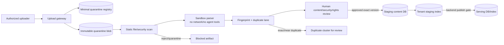

# Secure upload, quarantine và duplicate resolution v0.1

> Clarification v0.1.1 (2026-09-06), theo yêu cầu xử lý review: phân biệt restricted inspection với learner serving. U-01..U-12 và fixtures/kết quả 2026-09-05 giữ nguyên historical version; các metric/semantics bên dưới dùng profile clarification mới, không chấm lại history ngầm. Đây chưa phải chứng nhận scanner/enforcement runtime.

Ngày cập nhật: 2026-09-05

Trạng thái: **U-01..U-12 được người dùng chấp thuận ngày 2026-09-05 và freeze làm policy candidate v0.1; chưa có upload pipeline, scanner, duplicate detector hoặc index promotion runtime**.

## 1. Quyết định cốt lõi

Upload thành công **không** đồng nghĩa tài liệu được đưa vào content database, parser corpus, embedding queue hoặc serving index.

Upload ban đầu chỉ được phép tạo:

1. một `upload_receipt` tối thiểu trong quarantine registry;
2. một raw blob immutable trong tenant-scoped quarantine storage;
3. audit record gồm uploader, tenant, size/type, hash, thời điểm và trạng thái.

Quarantine registry không phải serving/content DB. Nó không lưu extracted text/chunk/embedding và không được query bởi Academic Assistant. Một registry tối thiểu vẫn bắt buộc để chống retry/race, truy vết hai người upload cùng file và revoke/delete đúng blob.

## 2. Tách các vùng dữ liệu



Invariants:

- upload gateway không có credential ghi serving DB/index;
- scanner/parser không có credential publish hoặc query tenant corpus;
- sandbox parser không có network, agent tools hoặc downstream action capability;
- duplicate detector chỉ ghi quarantine diagnostics/cluster, không merge/publish;
- chỉ Backend publish workflow có thể promote exact approved version;
- serving retrieval không bao giờ đọc quarantine/staging namespace.

## 3. Intake states tách khỏi document lifecycle

```text
received
→ static_scanning
→ isolated_parsing
→ duplicate_analysis
→ awaiting_security_rights_content_review
→ approved_for_staging
→ staged
→ published
```

Nhánh chặn:

```text
received/... → rejected_file
received/... → quarantined_security
duplicate_analysis → exact_duplicate_linked
duplicate_analysis → possible_duplicate_review
review → changes_requested | rejected | quarantined_security
```

`published` ở đây chỉ xảy ra sau lifecycle approval hiện hành; không có đường trực tiếp `received → staged/published`.

## 4. Security scan trước parse/index

Defense in depth tối thiểu:

- allowlist extension và business MIME; không tin filename/`Content-Type`;
- file signature/magic, size, page/object count, decompressed-size và resource limits;
- randomized storage name, không dùng user path và không public URL;
- malware/sandbox scan; CDR khi format/use case phù hợp;
- PDF/DOCX active content, JavaScript/actions, macros, embedded files, launch actions, external links và malformed objects;
- encrypted/password-protected file → giữ quarantine và yêu cầu workflow riêng;
- secret/credential/PII/rights canary scan trước external processor;
- text-layer vs OCR/render comparison để tìm hidden/white/tiny/off-page text;
- image/annotation/alt-text inspection vì injection có thể nằm ở modality khác;
- time/memory/page/recursive expansion limits để chống PDF/ZIP bomb.

Scanner chỉ tạo risk signals. “Scan clean” không biến source thành instruction đáng tin cậy và không tự cho phép publish.

### Restricted inspection khác serving

- Assigned reviewer có `inspect_quarantine` trên exact submission/snapshot và purpose review; isolated worker có `inspect_quarantine_ocr` khi chưa phân loại và cần đọc chữ trong ảnh. Không cấp hai action này cho learner-facing agent.
- Inspector xử lý local trong sandbox, không network/tools/egress; artifact có trust label, restrictions và audit riêng. Review UI dùng mediated inert preview trong vùng kiểm tra, không public URL hoặc raw active HTML/PDF execution.
- Chữ có khả năng là secret được nhận diện lần đầu bởi OCR trong inspection lane không tự là serving leak. Output phải nằm trong restricted security-review sink; không đi generic model, embedding queue, candidate semantic index, telemetry raw hoặc serving viewer. Job đọc lại phải recheck classification/revision.
- File đã classified `secret_forbidden`, active exploit hoặc resource bomb không được tiếp tục generic parse/OCR. Incident triage đặc biệt chưa được authorize bởi clarification này.
- Marker nghi ngờ giữ `suspected/review_pending`; detector miss vẫn là detector-quality failure. Không được bỏ unknown cases khỏi denominator để giảm exposure score.
- Student/Academic/Learning/Hub vẫn không đọc quarantine. Inspection allow không kế thừa content approval, rights hoặc publish.

## 5. Chống indirect prompt injection

Indirect injection có thể nằm trong text nhìn thấy, hidden text, ảnh, metadata, comment/annotation hoặc chỉ khác bản hợp lệ vài ký tự. Vì detector không thể hoàn hảo:

1. source luôn mang trust label `untrusted_content` kể cả đã publish;
2. parse trong sandbox không network/tools;
3. instruction-like spans được đánh dấu để reviewer xem nhưng không tự sửa/xóa nội dung học thuật;
4. source text được serialize như quoted evidence, không trộn vào system/tool instruction;
5. agent/tool PEP vẫn chặn cross-tenant/export/write dù injection lọt detector;
6. delta gần-duplicate chứa URL, imperative instruction, hidden style hoặc credential pattern được ưu tiên review;
7. approval không cấp source quyền điều khiển tool.

## 6. Duplicate detection theo tầng

Chỉ deduplicate trong cùng tenant theo mặc định. Không dùng global hash lookup để báo “file đã tồn tại ở trường khác”, vì chính tín hiệu đó có thể làm lộ tài liệu mật.

| Tầng | Fingerprint/signal | Bắt loại nào | Quyết định tự động được phép |
|---|---|---|---|
| D0 | idempotency key + upload session | Retry cùng request | Trả cùng receipt |
| D1 | raw bytes SHA-256 + size | Exact binary duplicate | Reuse tenant blob; giữ submission/audit riêng |
| D2 | sanitized canonical representation hash | Cùng nội dung nhưng metadata/container khác | Tạo exact-content cluster, không publish |
| D3 | page/section token shingles + MinHash/SimHash | Khác vài ký tự, reorder nhỏ, thêm watermark | Flag possible duplicate + diff review |
| D4 | page image perceptual hash/layout fingerprint | Scan/render gần giống, text layer khác | Flag visual duplicate/hidden-layer mismatch |
| D5 | semantic similarity trong quarantine-only index | Paraphrase/biến thể lớn hơn | Candidate signal, không tự merge |

Không chốt threshold D3–D5 trước khi có labeled duplicate/non-duplicate pairs. BGE-M3 nếu được thử chỉ chạy trong quarantine experiment/index, không ghi serving index và không tự đưa ra canonical identity.

## 7. Hai giáo viên upload cùng/ gần cùng tài liệu

Mỗi upload tạo submission/audit riêng dù raw blob được reuse. Không mất provenance của giáo viên thứ hai.

| Tình huống | Xử lý |
|---|---|
| Exact raw hash, cùng tenant | Một tenant blob; hai receipts/submissions; link existing material/version nếu quyền hợp lệ |
| Cùng normalized content, khác filename/metadata | Cluster `exact_content_duplicate`; reviewer xác nhận canonical material |
| Gần giống, khác vài ký tự | Character/token/section diff; kiểm hidden/instruction-like delta; không auto merge |
| Bản sửa hợp lệ | Reviewer tạo immutable new version và `supersedes` relation |
| Hai biến thể giảng dạy hợp lệ | Giữ hai material variants theo lecturer/course/term; không ép merge |
| Cùng title nhưng nội dung khác | Không merge; title không phải identity |
| Duplicate nhưng uploader không có rights | Không kế thừa rights/approval từ bản cũ; submission bị giữ/reject riêng |
| Cùng hash ở tenant khác | Không báo existence/canonical ID; lưu/đánh giá độc lập theo tenant |

Canonical resolution là quyết định của Course Owner/Curator theo assignment; agent, uploader và duplicate model không tự chọn.

## 8. Diff review cho near duplicate

Reviewer cần thấy:

- raw/normalized hashes và similarity signals;
- page/section alignment, added/removed/changed spans;
- Unicode normalization và confusable/invisible characters;
- changed URLs, email, code blocks, comments/annotations và embedded objects;
- text-layer vs rendered/OCR mismatch;
- instruction-like deltas, đặc biệt quanh “ignore”, “system”, “tool”, “export”, “secret”, URL/exfiltration patterns;
- author/rights/course/term/version provenance của từng submission.

Risk signal không được dùng để kết luận học thuật sai. Reviewer có thể chọn `exact_duplicate`, `new_version`, `legitimate_variant`, `unrelated_title_collision`, `security_quarantine` hoặc `needs_owner_review`.

## 9. Concurrency và idempotency

- unique reservation logic theo `(tenant_id, raw_sha256)` ở quarantine registry;
- two simultaneous uploads có thể tạo hai receipts nhưng tối đa một raw blob write thành công;
- object write immutable, verify hash sau upload; không overwrite theo filename;
- duplicate cluster update transactional/optimistic-versioned;
- retry trả receipt hiện có khi idempotency context khớp;
- không khóa/global-query hash xuyên tenant;
- publish exact version dùng compare-and-set trên lifecycle/revision/index alias.

## 10. Authorization actions mới

- `upload`: nhận bytes và tạo receipt sau auth/quota/type gates;
- `quarantine_store`: ghi raw blob/registry trong exact tenant;
- `transform`/`ocr`: chỉ sandbox job capability trên exact submission/version;
- `resolve_duplicate`: Course Owner/Curator; model chỉ đề xuất signal;
- `promote_to_staging`: cần security + rights + content review pass;
- `index`: chỉ tenant staging index;
- `publish`: Backend lifecycle gate mới được đổi serving alias.

Clarification v0.1.1 thêm `inspect_quarantine`/`inspect_quarantine_ocr`, exact submission + assigned principal + review purpose + current revision, không dùng quyền `read` tổng quát. Acceptance cases nằm trong [review regression registry](../evaluation/29-review-regression-and-metric-clarifications-v0.1.md).

Uploader không tự `resolve_duplicate`, `promote_to_staging` hoặc `publish`. Indexer không tự đổi lifecycle/canonical material.

## 11. Records tối thiểu

### Quarantine receipt/registry

- receipt/submission ID, tenant, uploader, authz decision;
- server-generated object key, raw SHA-256, size, detected type;
- idempotency key digest, upload timestamp, current intake state;
- parent/retry/concurrent-upload references;
- scan/parser/fingerprint job IDs và policy/tool versions;
- no raw extracted content, no embedding, no public source URL.

### Duplicate cluster

- tenant-scoped cluster ID;
- member submission/material/version references;
- fingerprint/similarity/diff artifact references;
- candidate reason and detector version;
- reviewer decision/actor/time/reason;
- canonical/new-version/variant relation nếu đã duyệt.

Logical fields và trust boundary chi tiết được ghi trong [quarantine manifest/aligned-delta contract v0.1](../../contracts/quarantine-manifest.md). Đây vẫn là đặc tả review, chưa phải JSON Schema hoặc runtime persistence.

## 12. Metrics và gates

| ID | Metric | Gate/ý nghĩa |
|---|---|---|
| UPL-01 | Upload-to-serving bypass count | **0** |
| UPL-02 | Quarantine content visible to learner retrieval/model/viewer hoặc unassigned inspection principal | **0**, profile clarification-v0.1.1; authorized isolated inspection báo riêng |
| UPL-03 | Known forbidden active/secret file continues into generic parser/provider/index, hoặc inspection output crosses a forbidden sink | **0**, profile clarification-v0.1.1 |
| UPL-04 | Exact duplicate recall | 100% trên raw-hash fixture |
| UPL-05 | Near-duplicate recall/precision | Báo riêng; threshold sau labeled set |
| UPL-06 | False merge rate | **0** trên legitimate-variant/title-collision critical set |
| UPL-07 | Poisoned-delta promotion | **0** |
| UPL-08 | Provenance completeness | 100% submissions, kể cả blob reused |
| UPL-09 | Concurrent duplicate blob writes | Tối đa 1 blob/tenant/hash; đủ receipts |
| UPL-10 | Cross-tenant duplicate existence leakage | **0** |
| UPL-11 | Review queue rate/time | Operational diagnostic, không bù security |
| UPL-12 | Post-approval injection tool success | **0**; complete mediation vẫn bắt buộc |

## 13. Các quyết định cần review

Quyết định review: **ACCEPTED U-01..U-12 — 2026-09-05**. Thay đổi về sau phải ghi reason, tăng policy/fixture version và không sửa history để làm implementation pass.

| Ref | Proposal mặc định |
|---|---|
| U-01 | Raw file vào tenant quarantine object store, không vào content DB/serving index |
| U-02 | Chỉ minimal receipt/hash/state ở quarantine registry |
| U-03 | Exact blob dedup chỉ trong tenant; không global dedup ở giai đoạn đầu |
| U-04 | Blob có thể reuse nhưng mỗi uploader giữ submission/provenance riêng |
| U-05 | Near duplicate không auto merge; bắt buộc diff + human owner/curator decision |
| U-06 | Hai lecturer variants có thể cùng tồn tại nếu course owner duyệt |
| U-07 | Duplicate không kế thừa rights, review hoặc publish state |
| U-08 | Parser/fingerprint lane sandbox, no network/no agent tools |
| U-09 | Semantic duplicate search nếu thử dùng quarantine-only BGE-M3 index |
| U-10 | Mixed/hidden/instruction-like delta mặc định security quarantine |
| U-11 | Scan clean không làm source trusted; runtime tool authorization vẫn độc lập |
| U-12 | Upload response không tiết lộ confidential duplicate/canonical ID |

## 14. Nguồn tham khảo

- [OWASP File Upload Cheat Sheet](https://cheatsheetseries.owasp.org/cheatsheets/File_Upload_Cheat_Sheet.html)
- [OWASP LLM01:2025 — Prompt Injection](https://genai.owasp.org/llmrisk/llm01-prompt-injection/)
- [OWASP LLM08:2025 — Vector and Embedding Weaknesses](https://genai.owasp.org/llmrisk/llm082025-vector-and-embedding-weaknesses/)

Các control này là defense in depth; không có scanner hoặc duplicate detector đơn lẻ bảo đảm loại hết malicious content.

Synthetic review seed đã được tạo tại [duplicate detection labeled mini-set v0.1](../evaluation/22-duplicate-detection-labeled-mini-set-v0.1.md): 26 pairs, chưa chạy detector hoặc chốt threshold.
