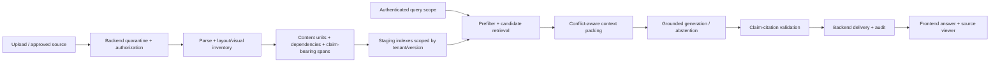

# Academic Assistant Master Plan v0.2

Ngày chốt bản: 2026-09-05  
Trạng thái: **working baseline cho giai đoạn trước product implementation**  
Nguồn trạng thái hiện hành: tài liệu này thay cho việc suy luận tiến độ từ số thư mục, experiment hoặc roadmap lịch sử.

## 1. Kết luận điều hành

Dự án đang ở **cuối research/architecture close-out**, chưa ở product implementation. Nền tảng problem, measurement, source representation, chunk/retrieval experiments, authorization và upload safety đã đủ để chuyển sang thiết kế artifact/index contract. Dự án chưa đủ điều kiện đóng AI Core workflow ở mức implementation vì còn thiếu multimodal/OCR decision, claim-conflict adjudication contract, reviewed validation split và một số boundary schema.

Điểm tiếp theo:

1. WP-01.1 review repair — **đã sửa draft/contracts và chạy bounded synthetic regression; human sign-off/runtime validation còn mở**.
2. WP-03 Evaluation registry normalization — 2026-09-06 đã có technical inventory/specification và bounded arithmetic tests; M0/human review, full semantic scorers/calibration còn mở.
3. WP-02 Multimodal ingestion/OCR readiness — technical documents/reinspection và decision review đã có; người dùng đồng ý text-first/visual-limited để chuẩn bị WP-04. Rights/labels/OCR validation không được xem là hoàn tất.
4. WP-04 AI Core workflow review packet — được giao chuẩn bị, ghi nhận 2026-09-07; draft cần Astra review, không runtime.
5. **Dừng tại ASTRA-01 để người dùng dùng Astra review trước mọi product code.**

Không tiếp tục mở rộng duplicate fixtures sau E0.9 trừ khi một design question cụ thể cần counterexample mới.

## 2. Định nghĩa “đã đi sâu” và “product code”

Những gì đã có là nghiên cứu có thể tái lập:

- scripts trong `ai-core/experiments/`;
- corpus/result local bị quarantine/ignore;
- source scaffold, README và boundary drafts;
- metric, threat model, fixtures và stop/go decisions.

Chúng **không phải product code**. Product implementation bắt đầu khi có một trong các hành động:

- thêm logic runtime vào `ai-core/src/academic_ai/`;
- thêm package manifest, dependency lock hoặc executable entrypoint của sản phẩm;
- tạo parser/index writer/retriever/agent adapter dùng trong application flow;
- đóng state machine, retry/idempotency và side effects thành runtime behavior;
- kết nối content DB, vector store, model provider hoặc backend facade thật;
- thêm service/deployment config nhằm chạy use case sản phẩm.

Static contracts và workflow diagrams vẫn là thiết kế. Tuy nhiên khi diagram/contract đã đủ chi tiết để map trực tiếp thành application orchestration, nó phải đi qua ASTRA-01 trước khi triển khai.

## 3. North-star vertical slice

Luồng đầu tiên vẫn là:

> Chọn phạm vi môn → hỏi một khái niệm/so sánh → nhận giải thích grounded → xem claim-citation → mở đúng source version/locator.

Luồng này phải chứng minh được:

- deny trước retrieval nếu scope không hợp lệ;
- evidence cần thiết không bị mất tại parser, chunk boundary hoặc packing;
- câu hỏi so sánh có đủ hai phía;
- conflicting version/claim không bị collapse vì similarity cao;
- answer thiếu evidence thì abstain;
- citation viewer kiểm tra lại quyền và đúng source version;
- mọi stage có trace để xác định first causal failure.

Upload, Knowledge Hub, Learning Assistant và multi-agent mở rộng chỉ đi sau khi vertical slice này hoạt động và đo được. Upload safety research hiện là guardrail đầu vào, không làm thay đổi thứ tự product slice.

## 4. Pipeline đích và trust boundaries

Backend là authority cho identity, authorization, lifecycle và publication. AI Core giữ scope đã được cấp nhưng không tự mở rộng hoặc duyệt nguồn. Frontend không truy cập model, vector store hoặc storage trực tiếp.

## 5. Phase map hiện hành

| Phase | Mục tiêu | Exit gate | Trạng thái 2026-09-05 |
|---|---|---|---|
| P0 Problem và scope | MVP, non-goals, user flow, failure definition | User review scope; không lấy agents làm điểm xuất phát | **Draft complete** |
| P1 Data, rights và governance | Provenance, lifecycle, tenant isolation, quarantine | Nguồn sản phẩm có owner/rights; policy critical không còn mâu thuẫn | **Research-ready; product gate chưa đạt** |
| P2 Measurement contract | Metric registry, denominator, slices, hard gates | M0 review; critical metrics không bị average che | **Advanced draft** |
| P3 Source representation | Layout-aware events, locator, table/image/code/formula dependencies | Không silent-loss trên reviewed probes | **Text path advanced; visual/OCR partial** |
| P4 Chunk/index/retrieval research | Boundary, sparse/dense/fusion/packing, conflict counterexamples | Candidate architecture có evidence theo slice | **WP-01.1 corrected draft; multimodal/eval/runtime validation còn mở** |
| P5 AI Core workflow design | Implementation-grade states, ports, failures và test map | **ASTRA-01 + user GO** | **Được giao chuẩn bị WP-04 review draft 2026-09-07; chưa review/GO** |
| P6 Product vertical slice | Runtime QA flow xuyên AI Core/Backend/Frontend | Behavior/security/integration gates pass | **Chưa bắt đầu** |
| P7 Generation và agents | Oracle generation → E2E RAG → router/tools/HITL | M4–M6 gates, zero critical leak/misroute | **Chưa bắt đầu** |
| P8 Pilot/deploy | Operational budget, usability, acceptance | N1–N3/N5 và stakeholder acceptance | **Chưa đủ điều kiện** |

Vị trí hiện tại: **P5 chuẩn bị review packet**, mang theo validation debt từ P1–P4. Không được diễn giải các local experiments hoặc scope acceptance là đã hoàn thành P5/P6.

## 6. Work packages trước ASTRA-01

### WP-01 — Content unit và index contract

Trạng thái cập nhật 2026-09-06: **WP-01.1 corrected draft, chưa freeze hoặc human sign-off**. Review phát hiện chín vấn đề, đã sửa contract và thêm regression giới hạn; không dùng trạng thái “đã viết xong” như đã nghiệm thu.

Đầu ra: `docs/architecture/07-content-unit-index-contract-v0.1.md`, `contracts/content-unit-index.md` và các boundary references liên quan.

Phải định nghĩa riêng:

- source snapshot, material version, physical page và logical section;
- typed block/atom: paragraph, list, table cell, code, formula, image region;
- retrieval child, context parent và dependency edge;
- claim-bearing span, claim delta và unresolved conflict;
- tenant/course/term/visibility labels dùng cho prefilter;
- lexical/dense/metadata/visual index surfaces;
- candidate relation `similar`, không biến thành `same_as`;
- tombstone/revoke/version semantics và locator stability.

Gate WP-01:

- không có object nào đồng thời sở hữu content truth và authorization truth;
- mọi retrieval item truy ngược được source version + physical locator;
- conflict không bị overwrite/collapse;
- parent/image fetch không thể vượt query scope;
- index lifecycle không biến quarantine item thành published item.

Kết quả chốt:

- định danh bytes/submission/source snapshot/material/version/representation/unit/projection được tách riêng;
- similarity chỉ sinh `candidate_similar`, không phải equivalence/truth/merge;
- conflict set và claim delta được giữ riêng, không overwrite nguồn;
- active index là verified rebuildable projection, tách quarantine/staging;
- revoke dựa vào current PDP/policy epoch trước, purge index sau;
- `CU-01..05`, `IX-01..10` và `CR-01..03` được chuyển tiếp cho WP-03.

### WP-01.1 — Review repair (2026-09-06)

[Repair registry](../evaluation/29-review-regression-and-metric-clarifications-v0.1.md) nối F-01..09 với sửa đổi, metric definitions, 23 offline regression methods và 21 contract cases chưa chạy. Hai code defects được xử lý trong experiment version riêng, giữ nguyên R2–R4 scripts/config/results. Không có schema runtime, index writer, model run hay PDP implementation mới.

Exit của vòng repair: synthetic regression pass, source/data integrity pass, mọi finding có disposition. Đây không phải exit gate của product: automatic dependency discovery, human labels, OCR, current authorization và race/concurrency vẫn cần kiểm chứng. Thứ tự tiếp theo điều chỉnh thành WP-03 inventory → WP-02 readiness → WP-04/ASTRA-01.

### WP-02 — Multimodal ingestion/OCR readiness

Cập nhật 2026-09-06: [WP-02 handoff](../evaluation/34-wp02-readiness-handoff-v0.1.md) có decision table, SP01..12 + MM-P01..06 protocol và source/render hash record của 6 trang xem lại trong 4 PDFs. Docs/integrity verified local, chưa OCR/parser comparison, human labels hoặc rights approval; render warnings vẫn được giữ. WP-02 là **technical draft complete / needs review**, không corpus production-ready. Không làm lại inventory; generic continue tiếp nhận decision/gap review từ handoff này trước khi chuyển WP-04.

Đầu ra dự kiến: parser/OCR decision table và experiment protocol, chưa phải adapter runtime.

Phải tách:

- born-digital text, scanned page, mixed page, slide-heavy page;
- text layer, render, OCR và visual description là các representation khác nhau;
- OCR transcription confidence, layout correspondence và image-region locator;
- local processing mặc định; external OCR/VLM cần rights/security decision riêng;
- image-only/hidden-text conflict phải fail closed khi modality bắt buộc chưa sẵn sàng.

Gate WP-02: không có silent fallback từ “OCR chưa chạy” thành “trang không có nội dung”.

Disposition ghi nhận 2026-09-07: [review 35](../evaluation/35-wp02-decision-review-v0.1.md) có 10 risks/decisions; người dùng đã trả lời “Tôi đồng ý” với scope text-first/visual-limited và việc chuẩn bị WP-04/Astra packet. DR-01 đóng riêng lựa chọn scope, không đóng fidelity/runtime validation; DR-02..10 vẫn mang theo. [Control record](../harness/WP02-WP04-reconciliation.md) là entry point mới; không lặp WP-02 review để xin lại scope.

### WP-03 — Evaluation registry normalization

Cập nhật 2026-09-06: [inventory và handoff](../evaluation/31-wp03-inventory-handoff-v0.1.md) đã hoàn thành technical scope với 18 artifact families/105 file pins, scorer specification và 19 synthetic arithmetic tests. Đây là đầu vào đủ để **soạn WP-02 readiness**, không là M0/user acceptance, đủ human labels hoặc toàn bộ scorer được implement/calibrate. Negative expansion oracle, claim/citation matching, RAGAS, thresholds và runtime integration tiếp tục pending; không mở M4/model benchmark từ kết quả này. Prepared WP03-01 cũ được thay bằng executed WP03-REGISTRY-01 cho lượt việc này, không sửa lịch sử card để giả execution.

Đầu ra dự kiến: một registry chỉ ra snapshot, label authority, split, eligibility và claim được phép cho từng pack.

Phải tách:

- assistant-silver dev;
- deterministic oracle/fixture;
- pending human review;
- validation dùng để chọn config;
- hidden/frozen test chỉ khi generator/reviewer độc lập.

Gate WP-03: mọi metric có numerator, denominator, excluded cases, version và `N/A` semantics; không dùng E0.3–E0.9 như hidden accuracy.

### WP-04 — AI Core workflow review packet

Chỉ bắt đầu sau technical inputs/dispositions WP-01..03; không hàm ý các gói đã có human/runtime acceptance. Được người dùng giao chuẩn bị sau scope confirmation, ghi nhận 2026-09-07. Packet phải gồm:

- state/sequence diagram từ admission đến answer/citation;
- public ports và component ownership;
- authorization context propagation;
- idempotency, retry, timeout, cancellation và partial-result semantics;
- prompt-injection/untrusted-source boundaries;
- conflict/abstention/HITL states;
- model/token/index budgets;
- telemetry và first-causal-failure fields;
- behavior/security test matrix;
- dependency candidates kèm license, local/external data implications.

WP-04 vẫn là tài liệu. Khi packet đủ để review, kích hoạt ASTRA-01.

## 7. ASTRA-01 — mandatory AI Core workflow review gate

### Trigger

Gate kích hoạt **trước lần đầu** sửa runtime AI Core hoặc đóng implementation workflow. Khi trigger xảy ra, Codex phải:

1. dừng trước product code;
2. báo rõ cho người dùng: `Đã tới ASTRA-01: cần review AI Core workflow`;
3. cung cấp review packet và danh sách câu hỏi cho Astra;
4. ghi findings/severity/decision sau review;
5. chỉ tiếp tục khi người dùng xác nhận explicit GO sau khi đã xem findings.

### Astra review checklist tối thiểu

- authority confusion hoặc agent tự mở rộng scope;
- cross-tenant retrieval, parent expansion, cache và source-viewer leakage;
- indirect prompt injection từ text, metadata, annotation, URL, image/OCR;
- stale ACL, revoke race, retry và duplicate side effects;
- similarity bị dùng nhầm làm equivalence/truth/security decision;
- claim conflict, negative-context loss và top-1 evidence masking;
- index poisoning, namespace collision và provenance tampering;
- resource exhaustion qua PDF/page/token/fan-out/tool loop;
- external provider exfiltration và data retention;
- secret admission/logging, unsafe error payload và audit incompleteness;
- dependency/license/supply-chain risk;
- test gaps giữa domain rule, adapter và end-to-end enforcement.

### Không được xem là approval

- Astra không tìm thấy lỗi trong một lần đọc;
- static schema validation pass;
- synthetic fixture đạt 100%;
- local model run ổn định;
- một diagram nhìn hợp lý;
- Codex tự đánh dấu review complete.

Approval cần người dùng xác nhận sau khi xem review output.

## 8. Product implementation sau ASTRA-01

P6 chỉ làm một vertical slice tối thiểu:

1. AI Core domain types và ports cần cho grounded QA.
2. In-memory/fake adapters trước, không chọn production database theo quán tính.
3. Backend truyền trusted scope và kiểm tra output/citation access.
4. Frontend hiển thị answer/abstain/error và mở source locator.
5. Behavior tests map trực tiếp từ metric/security cases.
6. Chỉ thêm infrastructure adapter thật sau khi domain/application behavior pass.

Không triển khai ba agents đầy đủ trong P6. Academic QA manual mode là slice đầu; router, Learning Assistant và Knowledge Hub orchestration thuộc P7.

## 9. Decision inventory

### Đã freeze ở mức design

| Decision | Trạng thái |
|---|---|
| Source documents là untrusted data | Freeze |
| Upload đi vào tenant quarantine, không vào serving index | Freeze |
| Backend là authorization authority | Freeze |
| Prefilter trước retrieval và recheck khi fetch/deliver | Freeze |
| Provenance/version/physical locator phải được giữ | Freeze |
| Similarity chỉ tạo candidate; không auto-equivalence/auto-merge | Freeze |
| Conflict chưa phân giải → abstain/HITL | Freeze |
| BGE-M3 là embedding baseline local đầu tiên | Freeze cho research baseline, không phải production winner |

### Provisional — cần WP-01..04

| Decision | Bằng chứng hiện có | Còn thiếu |
|---|---|---|
| Structure-aware child/parent chunking | Không cắt atom ở R1 | Visual/formula/code negative-context review |
| Hybrid retrieval + rerank | R2–R4 dev diagnostics | Reviewed validation và access-filter integration |
| Context budget 2.048 | Đủ 10/10 dev packet ở R3 | Generator choice, latency/cost và long-document slices |
| Candidate K=2/K=3 | Đủ trên E0.8/E0.9 synthetic | Hidden/realistic corpus và class-specific budget |
| Exact-first routing | Giảm review/retriever load ở E0.8 | Scale, concurrency và poisoned exact-path enforcement |

### Chưa chọn

- product parser/OCR/visual model;
- production vector store/content database/object storage;
- cross-encoder/NLI/claim adjudicator;
- generator LLM, prompt set và judge models;
- auth provider/federation;
- deployment topology, cloud và SLA;
- semantic cache policy;
- production thresholds.

## 10. Metric map theo phase

| Phase | Metric trọng tâm | Hard gate |
|---|---|---|
| P1 | AUTH-01..14, UPL-01..12 | 0 cross-tenant false allow; 0 quarantine bypass |
| P3 | locator validity, atom preservation, visual/OCR eligibility | 0 silent required-evidence loss |
| P4 | macro/micro group recall, all-evidence success, dependency recall, packing retention | Access leak = 0; comparison coverage đủ hai phía |
| WP-01 | version/locator integrity, conflict preservation, revoke/index consistency | Không collapse conflict; không fetch ngoài scope |
| WP-02 | OCR eligibility, transcription/layout alignment, modality conflict recall | Required modality pending → fail closed |
| WP-03 | eligibility coverage, label authority, split leakage | Dev không được báo thành hidden/test |
| P6 | behavior pass, citation correctness/coverage, abstention, first causal failure | Critical policy/citation errors = 0 |
| P7 | oracle GAP, E2E GAP, tool/goal accuracy, loop/misroute | Unauthorized tool/data action = 0 |
| P8 | latency/cost/usability/learning study | Không suy learning gain từ offline metrics |

RAGAS chỉ là automated diagnostic sau calibration; không bù cho hard gates về quyền, citation, conflict hoặc leakage.

## 11. Điều kiện dừng và escalation

Dừng để hỏi người dùng khi:

- một lựa chọn làm thay đổi local-only/external-processing policy;
- cần dùng nguồn chưa rõ rights hoặc dữ liệu người dùng thật;
- cần teacher/content-owner authority;
- threshold/candidate budget sắp được freeze;
- sắp chọn product infrastructure có chi phí/lock-in;
- ASTRA-01 được kích hoạt;
- metric critical không có oracle hợp lệ.

Không coi thiếu giáo viên là lý do dừng mọi technical preparation, nhưng không nâng silver thành gold hoặc gọi kết quả là academic acceptance.

## 12. Handoff hiện tại

WP-01.1 vẫn corrected draft/bounded regression; WP-03 và WP-02 technical inputs đã có, human/M0/calibration/rights/runtime pending. **Next = WP-04 review-packet preparation**, dựa trên user scope confirmation và [reconciliation record](../harness/WP02-WP04-reconciliation.md). Đã báo `Đã tới ASTRA-01: cần review AI Core workflow`; chuẩn bị packet/questions, sau đó chờ review findings và explicit user GO. Generic continue không tự chuyển P6 hoặc chạy model/PDF processing. Scope confirmation không là approval sản phẩm.
